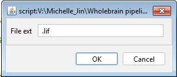
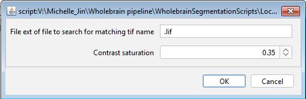

```{r, include = FALSE}
options(width = 300, rmarkdown.html_vignette.check_title = FALSE)
knitr::opts_chunk$set(
  collapse = TRUE,
  comment = "#>",
  echo = TRUE, 
  eval = FALSE
)
```

# Imaging, pre-processing & segmentation

<figure>
  
  <figcaption><em>Imaging, segmentation, and pre-processing pipeline</em> </figcaption>
</figure>

## Imaging parameters

Our example images were taken on a confocal scanning microscope (Leica TCS SP8, Leica Microsystems Inc. Wetzlar, Germany) with two PMT detectors using a dry 20x objective (NA 0.60, working distance 0.5 mm). We use the following imaging parameters:

+ Pixel size of 1.08 x 1.08um^2^
+ z-step size of 3 um
+ z-stack size of 9 um. 

The first channel of our images (C1) captures YFP staining, while the second channel of our images (C2) captures cfos staining. Immunolabelling details are documented in our companion paper (To Link). Fields of view are stitched together to form tiled images by using an automated stage and the tiling function and algorithm of the LAS X software. An example image taken using these settings without any previous pre-processing steps is [downloadable](https://osf.io/6hq42). 

Although this pipeline is designed to be generalizable to other images with different parameters we recommend organizing and saving channel order in a similar format to ours.

## File organization

Each image file is stored in a hierarchical folder structure in a slice folder then a mouse folder:

`Root folder > project folder > ... > mouse no. > slice name > image file`

The image files, which we also refer to as slices, are assumed to follow the naming convention `mouseNo_slice.ext`. 

The `slice` is a unique tag or index used to identify the particular section when it was imaged on a slice. For example, we use 
an indexing system where the first number identifies the slide number and a second number identifies position on that slide. These numbers are separated by an underscore. Therefore the slice `1_1` represents section one of slide one for this animal. Of course, other indexing approaches can be used. We create a slice name by concatenating the slice with the mouse ID separate by an underscore to name images unambiguously. 

For example, here is one of our image directory paths: 

`V:/Learned_Helplessness/Mapping_Images/Shock/733/733_1_1`

And this is the file path to the image stored in that directory:

`V:/Learned_Helplessness/Mapping_Images/Shock/733/733_1_1/733_1_1.lif`

Here, the image or slice name is `733_1_1.lif` with the slice no. being `1_1`. This section came from mouse 733. This heirarchical file structure is helpful, as all segmentation files and preprocessing files will be stored in each image folder while all mouse object files will be stored in the parent mouse directory. 

## FIJI/ImageJ Software Setup

To use the segmentation macros we have on this example dataset, [Fiji/ImageJ](https://imagej.net/software/fiji/downloads) needs to be installed as well as the [Bio-Formats Importer](https://imagej.net/formats/bio-formats) and [3D ImageJ suite](https://mcib3d.frama.io/3d-suite-imagej/#installation) plugins. Follow the steps to install the plugins either using the update site option or manually. We have validated our pipeline using ImageJ version 2.9.0 (64-bit).

The Bio-Formats Importer is just a plugin that helps import a variety of common imaging formats into ImageJ. 3D ImageJ Suite provides a suite of plugins to enhance 3D  image processing capabilities. Our segmentation and colocalization macros are dependent on the 3D ImageJ Suite plugin and we have validated our segmentation scripts on the latest version of the plugin (v4.1.5).

## Convert to TIFF

For full transparency of our pre-processing steps, our example raw image provided is in the format exported immediately after image acquisition. The image file format is a .lif file, which is a proprietary format associated with Leica microscopes. 

To make our segmentation approach more generalizable, we convert our image to .tif files before proceeding with the rest of preprocessing. We can do this automatically using an Image [macro](https://osf.io/uarnt) that iterates through all .lif files in a root folder. Drag the macro file into the ImageJ window and once the macro window pops up, click "Run". You should see the following pop up window.

<figure>
  
  <figcaption><em>batch_create_tiff.ijm pop up window </em> </figcaption>
</figure>

Hit "OK", then navigate to a root folder and hit "Select". ImageJ will then convert all images in subdirectories of the root folder matching the .lif extension. 

For those who are not using Leica microscopes, starting with a .tif file will serve as a general entry point into the pipeline. If this is the entry point, an empty file should be created in each image folder saved as the image name with an extension other than .tif, e.g. 733_1_4.lif. This will be used as a dummy file to hunt for the proper image name in downstream pre-processing and segmentation steps. .tif cannot be used because a number of .tif files are optionally created as outputs from segmentation.

<figure>
  
  <figcaption><em>Save an empty file with the same image name and a unique extension </em> </figcaption>
</figure>


## Flatten the TIFF images for registration

Although cell counts may be segmented in 3D, during the registration process, a single coronal atlas plate from the Allen Mouse Brain Atlas is fitted to a 2D `.tif` image. 
Therefore, if you are processing any z-stack images, they need to be flattened and channels need to be collapsed into a single image used for the purpose of registration. For our images, we have an [ImageJ macro](https://osf.io/2thw8) that does this on our .tif images automatically by creating a maximum projection image. 

The followup window should popup when you run this macro. The default parameters should be fine, but  you can change the contrast saturation parameter to optimize the image saturation levels. Please note that the .lif extension is still used *only* to detected the original image name.

<figure>
  
  <figcaption><em>batch_create_max_projection pop up window </em> </figcaption>
</figure>

The default parameters should be fine, but you can change the contrast saturation parameter to optimize the image saturation levels. The transformed images are then autosaved into each image directory as `MAX_SliceName.tif`. The path to this file will be used as the registration path. Note that once this file is made, any part of the pipeline using SMARTR related to image registration can proceed independently of image segmentation. 

## c-Fos segmentation using a generalized 3D segmentation macro

We have developed a generalized ImageJ [macro](https://osf.io/bek56) that works well for segmenting cells from images with staining patterns characteristic of c-Fos immunolabelling. c-Fos staining is typically punctate and nuclear, with each cell resembling a filled sphere. We recommend using this macro twice if you are staining two channels with similar immunolabelling patterns as c-Fos. 

The macro segments c-Fos cells using the following steps.

+ Images are [bandpass filtered](https://imagej.nih.gov/ij/plugins/fft-filter.html) in Fourier space
+ Image background is subtracted using a [rolling ball algorithm](https://imagej.net/plugins/rolling-ball-background-subtraction)
+ Cells are identified using the 3D Local Maxima Faster Filter, [3D Spot Segmentation](https://imagej.net/plugins/3d-segmentation)
+ Cells are quantified and saved using the 3D Manager plugin
+ The binary segmentation image is optionally saved as a .tif.

<figure>
  
  <figcaption><em>batch_3DSegmentation_Fast pop up window </em> </figcaption>
</figure>

Hit 'Run' to start the macro. The default parameters for these steps are already optimized for our imaging parameters and work well on our example image. The parameters are also user-modifiable to account for different imaging parameters and different channel orders. Hit 'OK' to accept the current parameters, then navigate to a root folder containing all the nested subdirectories you want to process. If there are many images to process, we recommend running this macro overnight, as it may be computationally intensive. Once processing is finished, you will notice two new .txt. files in each image folder starting with "M_" and "Q_"  that collectively store the quantified cell counts and each cell object's image properties. "Save segmentation binary?" needs to be checked at this step if you are interested in running this channel through a colocalization analysis downstream.

## eYFP segmentation 

Due to the dendritic expression of eYFP, we use a separate segmentation [macro](https://osf.io/tz2pe) optimized to segment eYFP+ cells with with more cellular processes branching from the cell body. The segmentation steps are similar in principle to that used for c-Fos staining:

+ Background subtraction
+ Image blurring with a Gaussian kernel
+ Image thresholding for the brightest fraction of pixels (e.g. threshold of 0.005 for the top 0.5% brightest pixels)
+ The brightest pixels are used as a mask to apply a 3D [watershed](https://imagej.net/plugins/classic-watershed) algorithim. This restricts the area of application of the algorithm.

The default parameters for this step are already optimized for our imaging parameters.To run images through the colocalization analysis, "Save segmentation .tif?" needs to be checked at this step. 

<figure>
  
  <figcaption><em>batch_EYFPSegmentation pop up window </em> </figcaption>
</figure>

Hit 'Run' and navigate to a root folder you want to process. Similarly to the c-Fos segmentation using the generalized 3D segmentation macro, new .txt files starting with "M_" and "Q_"  will store information about the quantified cell counts in each image folder.

## Co-labelled cell identification

This step is optional for those interested in looking at colocalized cell populations. We use the [3D MultiColoc](https://mcib3d.frama.io/3d-suite-imagej/plugins/Analysis/Relationships/3D-MultiColoc/) plugin in the ImageJ suite to identify co-localized cells. This plugin will identify the percentage of volumetric overlap between all objects in two different segmented images and return a table of these comparisons. Download our [macro](https://osf.io/dgsj4) which applies this plugin to all the images in a root folder that have already been segmented for c-Fos and eYFP. 

Run the macro and you will see the following menu pop up: 

<figure>
  
  <figcaption><em>batch_Coloc_cfos_eyfp popup window </em> </figcaption>
</figure>

Replace the entry for "C1 segmentation file ext" with the exact stem of the .tif storing the segmented objects for channel 1 (eYFP) without the image name. In our images, this stem is "_C1_eYFP_LabelImage.tif".  Then do the same thing for channel 2 for the c-Fos segmentation image. This macro will save additional colocalization information as .txt files in the image folder.

Once this step is done, you're ready to import the segmentation and colocalization information into the SMARTR pipeline!


