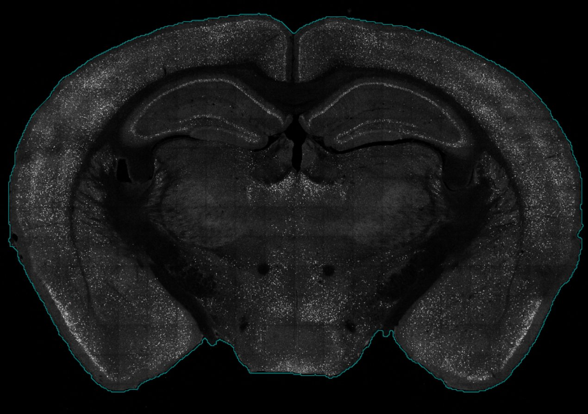

```{r, include = FALSE, eval=TRUE}
options(width = 300, rmarkdown.html_vignette.check_title = FALSE)
knitr::opts_chunk$set(
  collapse = TRUE,
  comment = "#>",
  echo = TRUE, 
  eval = FALSE,
  message = FALSE
)
```

# 0 Pre-processing 

SMARTR encapsulates the process of registration, importation of segmentation data, and performs downstream analysis. Prior to this, the imaging data must be pre-processed and cells are separately segmented in ImageJ/FIJI. We have a separate, in-depth [article](../articles/1.Segmentation.html) on our imaging approach, parameters, and segmentation process. We suggest starting there if you would like to walk through the pipeline from raw example image. The remainder of this page will focus on steps relevant to registration, segmentation data import, and downstream data analysis using SMARTR. We recommend completing the pre-processing and segmentation tutorial with the example image so you can walk through the SMARTR tutorial with this data.

<figure>
  
  <figcaption><em>SMARTR package features</em> </figcaption>
</figure>


## 0.1 File organization

Each image file is stored in a hierarchical folder structure in a slice folder then a mouse folder:

`Root folder > project folder > ... > mouse no. > slice name > image file`

The image files, which we also refer to as slices, are assumed to follow the naming convention `mouseNo_slice.ext`. 

The `slice` is a unique tag or index used to identify the particular section when it was imaged. For example, we use 
an indexing system where the first number identifies the slide number and a second number identifies position on that slide. These numbers are separated by an underscore. Therefore the slice `1_1` represents section one of slide one for this animal. Of course, other indexing approaches can be used. We create a slice name by concatenating the slice with the mouse ID separate by an underscore to name images unambiguously. 

For example, here is one of our image directory paths: 

`V:/Learned_Helplessness/Mapping_Images/Shock/733/733_1_1`

And this is the file path to the image stored in that directory:

`V:/Learned_Helplessness/Mapping_Images/Shock/733/733_1_1/733_1_1.lif`

Here, the image or slice name is `733_1_1.lif` with the slice no. being `1_1`. This section came from mouse 733. This heirarchical file structure is helpful, as all segmentation files and pre-processing files will be stored in each image folder while all mouse object files will be stored in the parent mouse directory.

## 0.2 Flatten any z-stacks for registration

Although cell counts may be segmented in 3D, during the registration process, a single coronal atlas plate from the Allen Mouse Brain Atlas is fitted to a 2D `.tif` image. 
Therefore, if you are processing any z-stack images, they need to be flattened and channels need to be collapsed into a single image used for the purpose of registration. This step needs to be completed prior to using SMARTR for registration. We detail how to do this in using our pre-processing [article](/articles/1.Segmentation.html)

# 1 Tutorial outline

In this tutorial, We will walk through the following steps using an example preprocessed image:

I.    Setting up the pipeline by specifying experimental parameters and save directories.
II.   The interactive registration process.
III.  Importing raw segmentation data from .txt files generated from ImageJ for multiple channels. This data will then be transformed into a segmentation object that is compatible with `wholebrain` functions.
VI.   Combining the segmentation and registration data to map cell counts onto a standardized mouse atlas.
VI    Cleaning the mapped data in all the following ways:
        A.   Removing cells that map outside the boundaries of the atlas.
        B.   Omitting regions by a default list of regions to omit.
        C.   Omitting new regions to omit by user-curated list for each image.
        D.   Removing cells from a contralateral hemisphere per slice if the registrations are divided by right and left hemispheres. 
VII.  Obtaining cell counts normalized by region volume (per mm^3^) and region areas (per mm^2^). 
VIII. (Optional) Splitting the hippocampal cell counts into dorsal and ventral based on a user-defined AP coordinate ranges.
IX    Aggregating cell counts across multiple animals.
X.    Quality checks to look for outliers in region cell counts prior to analysis.  
XI.   Functions for easy analysis, based on categorical variables entered as mouse attributes. These will include functions for region cross correlations and network analyses.

Functions for analysis and automated visualization are detailed in our example analysis [notebook](../articles/4.Example Analysis Notebook.html)
  
These steps will be achieved through functions that operate on objects in SMARTR. Objects are used to store raw data and processed data, as well as imaging, animal, and experimental parameters relevant to the analysis. Note that in a separate article, we describe ways to scale-up many of these steps to map images in a high-throughput manner with scripts. The modularity of these functions lend to the creation of many different custom workflows. We provide links to example notebooks that others can modify for their own datasets.


# 2 Pipeline setup

Okay, let's walkthrough the pipeline with an example mouse and image to process! 

```{r, eval=TRUE}
# Load SMARTR
library(SMARTR)
```


You can download our example fully pre-processed image folder [here](https://osf.io/4qfsc). 
This image came from mouse 733, so create a empty folder named `733` in a location of your choice and upzip the image folder into this folder.


## 2.1 Initializing a mouse object 


Let's create an instance of a mouse object. This mouse object will store data from mouse No. 733, so
we will name it `mouse_733`. We also want to store the important experiment metadata related to this mouse.
All of this can be done using the `SMARTR::mouse()` constructor function:

```{r, eval = FALSE}

# Create and store information for mouse 
mouse_733 <- mouse(mouse_ID = "733",
                   sex = "female",
                   strain ="129s",
                   experiment = "learned helplessness",
                   group = "context",   # Flexible attribute to encapsulate different experimental conditions, e.g. genotype, behavior conditions, that doesn't fit into other categories.
                   cohort = "group_A",
                   output_path = "P:/DENNYLABV/Michelle_Jin/Wholebrain pipeline/733")   # replace the output path with the path to your specific mouse folder
            

print(mouse_733)

```

Note that when we don't initially store the mouse metadata using variables passed to the mouse object constructor, this metadata is 'empty' and there are default values stored as placeholders.

```{r, eval = FALSE}
print(mouse())
```


## 2.2 Modifying mouse attributes

If you find that you've made a mistake in setting the attributes for a mouse object, don't worry. These attributes can be easily modified. We just need to pull out the `info` list containing the mouse attributes and manually correct them:

 
```{r}
# get the mouse info list
mouse_info <- attr(mouse_733, 'info')

# Change mouse attributes to reflect your mouse and experiment.
mouse_info$sex           <- 'male'
mouse_info$group         <- 'shock'
mouse_info$cohort        <- "group_B"

# Change mouse's attributes by storing the mouse info list back into the mouse
attr(mouse_733, 'info') <- mouse_info

# Check the updates 
print(mouse_733)

```
We have now finished setting up a mouse object and are ready to store some imaging and automated cell count data into it!

## 2.3 Initializing a slice object

Now we need to create a slice object. We also want to store imaging 
metadata as the slice object's attributes. For this we'll use the `SMARTR::slice()` constructor function.

Before doing this, look at your image and compare it with a standardized mouse atlas to decide what the most accurate AP coordinate should be prior to creating the object. You can reference either the 
[SMART reference atlas](https://osf.io/cpt5w) or [http://openbrainmap.org](http://openbrainmap.org). In our example image, we've already pre-assigned the coordinate.

Additionally, if you need to process each hemisphere separately due to hemisphere separation, tears, etc, it should be specified. There are built-in ways to clean data from a right hemisphere slice and omit the contralateral hemisphere for demonstration. If the left and right side align well onto a single atlas plate, initialize only one slice object and set the `hemisphere` attribute to NULL (or don't set it, as this is the default).


```{r}
s <- slice(slice_ID = "1_4",  
           coordinate = -2.14,         # AP coordinate that matches best matches the images
           conversion_factor = 1.0833, # Pixel-to-micron conversion factor. 
           bin = 1,                    # If the image was downsampled by a bin factor in imageJ
           z_width = 9,                # z-stack thickness in microns
           hemisphere = NULL,          # "left", "right" or NULL (both sides). This is necessary if you are only processing one hemisphere due to hemisphere separation, tears, etc.
           channels = c('cfos', 'eyfp', 'colabel'),  # Channels to process
           # registration_path = 'V:/Michelle_Jin/Wholebrain pipeline/733/733_1_4/MAX_733_1_4.tif'# Path to the registration image. Replace with your specific path
           registration_path = 'P:\\DENNYLABV\\Michelle_Jin\\Wholebrain pipeline\\733\\733_1_4_fully_processed/MAX_733_1_4.tif'# Path to the registration image. Replace with your specific path
          )  

# Let's check the data stored correctly with print()
print(s)
```

Note that if certain metadata were not specifically fed into the slice object constructor, default values are take. For example `left_regions_excluded` list regions that are omitted by default, including the fiber tracts, ventricular systems (VS), and layer 1 of all cortical regions. You can use the [Allen Mouse Brain Ontology](http://atlas.brain-map.org/atlas?atlas=1&plate=100960520) your own list of default regions to exclude.


## 2.4 Adding slice objects to mouse objects

We are ready to bundle our slice information with our mouse. But first...

Type the code below into the R console: 

```{r}
`mouse_733$`
```

You should see that a named list called `slices` pops up and you can complete the suggestion by hitting TAB.
The `$` operator is very useful for accessing any named element in a list. Right now, the `slices` list is NULL,
because it is empty and doesn't contain anything.

> Tip: You can use the `$` operator to look at named elements in a mouse. 


```{r}
# Check the length of slices in a mouse first
length(mouse_733$slices)

```


That will change soon after we add the slice into our mouse. Let's check out the help page of the function `add_slice()`. 

> Tip: Check the "Usage" or "Examples" section for a code example of how to use a particular function in a package

```{r}

?add_slice

```

Now that we've read how to use the function, let's add our slice to our mouse with the line below:

```{r}
mouse_733 <- add_slice(mouse_733, s)

# Check the length of slices now
length(mouse_733$slices)

# Access the new slice information with the code below
mouse_733$slices$`1_4`
```


> Note that if you've changed computers and you find the location of your mouse folder has changed in some way, e.g. different drive mapping letters on Windows or different OS, you can adjust for this using the `reset_mouse_root()` function. 

```{r}
# Change to the correct drive letter
mouse_733 <- reset_mouse_root(mouse_733, input_path = "C:/Michelle_Jin/Wholebrain pipeline/733")

```


# 3 Interactive registration

Now we are ready to begin registering this slice! Registration is the process of aligning your imaging dataset with a standardized mouse atlas. The wholebrain package does this by generating a set of correspondance points around the contours of the brain in your image, and aligning it with analagous points around an atlas plate from the standardized mouse atlas. 

Before we register we must first check that the contours of our brain sample can be detected properly. A proper outline of the brain contours are necessary to generate a good first-guess of correspondance point placement.


## 3.1 Detecting brain contours

To get a good outline of our brain, we need to feed a `filter` list which contains various parameters used to segment feature of interest in an image with wholebrain functions. We can autogenerate a default `filter` list with `SMARTR::filter`. Within this filter, we need to modify a parameter called the `brain.threshold` which is critical for detection the contours of the brain. We will adjust and check the effects of changing the `brain.threshold` parameter using the function `adjust_brain_outline()` This function uses a default `brain.threshold` of 10 and pops up a window showing the detected contours in a blue line. 

If the contours are unsatisfactory, press "esc" or "Q" to exit from the popup and you can use the interactive console interface to modify the value. I recommend modifying the value in steps of +/- 2. we will pass this filter to`SMARTR::register()` so the function knows which `brain.threshold` to use. Note that another GUI window pops up to modify various filter parameters, however it is quite buggy and often crashes I would recommend using the console interface.

If your imaging parameters are standardized. You may not need to adjust your filter on an image by image basis. Below we use the brain.threshold of 2 to detect the contours of our image.

```{r}

# store the default filter list from the SMARTR package
filter <- SMARTR::filter

# Manually adjust the brain.threshold in the filter list 
filter$brain.threshold <- 2

# Pass a slice object as an argument
# Interactively adjust the brain threshold until it looks good
# Store the output as a filter
filter <- adjust_brain_outline(mouse_733$slices$`1_4`, filter = filter)
```
  
<figure>
  
  <figcaption><em>Brain contour detection in blue.</em> </figcaption>
</figure>
  
## 3.2 Registration of a slice

The `register()` function is one of the generic functions of the package. Because of this, what the function does depends on the type of objects being fed into it. The `register()` function can be used on both `slice` and `mouse` objects. Examples of how to used this function with `slice` or `mouse` objects are found under the Usage section.

Pull up the help page with the code below:

```{r}
?register
```
 
If you use a `mouse` object with the function you need to specify which `slice_ID` and 
which `hemisphere` you want to register, because a `mouse` object may contain many slices.

Let register our example image using a mouse object! The code below will look for slice `1_4` in `mouse_733` and apply the filter settings with the brain.threshold. Note that the `mouse` object may contain many slices, so that is why we need to specify which `slice_ID` and 
which `hemisphere` to register

```{r, eval = FALSE}
mouse_733 <- register(mouse_733, 
                      slice_ID = "1_4",
                      hemisphere = NULL,
                      filter = filter)
```

<figure>
  
  <figcaption><em>First pass registration.</em> </figcaption>
</figure>

A graphics window should pop up showing the atlas superimposed on the registration image in two outlines. The yellow side is "atlas space" so the correspondence points appear around the boundaries of the atlas. The purple side is "image space" so correspondence points should fit around the contours of the actual brain tissue in the image. One this  window has loaded, there should be an interactive console interface allowing for the addition, removal, and changing of these default correspondence points. You can read more about the fitting process in the original wholebrain [publication](https://www.nature.com/articles/s41593-017-0027-7).

At this point, you may find it useful to save all your hard work after perfecting the registration. You can save the mouse object to its output folder with the command below.

```{r, eval = FALSE}
save_mouse(mouse_733)
```

Add the `timestamp` parameter to save the mouse object with today's date:

```{r, eval = FALSE}
save_mouse(mouse_733, timestamp = TRUE)
```

I recommend always saving with a timestamp so you never lose more than a day's worth of work if you accidentally overwrite something. 

# 4 Add segmentation data

## 4.1 Import raw ImageJ data

The segmentation data from ImageJ is stored into .txt files. We can use the `import_segmentation_ij()` generic function to import the raw data from ImageJ. 

```{r}
mouse_733 <- import_segmentation_ij(mouse_733,
                                    slice_ID = '1_4',
                                    hemisphere = NULL,
                                    channels = c('eyfp', 'cfos', 'colabel'))
```

The console output indicating successful importation of segmentation data should look like below:

```
Imported the following files: 

[1] "M_G_eYFP_733_1_4.txt"
[1] "Q_G_eYFP_733_1_4_eYFP.txt"
Imported the following files: 

[1] "M_C2_cfos_733_1_4.txt"
[1] "Q_C2_cfos_733_1_4_cfos.txt"
[1] "733_1_4cfos_SpotSegmentation_ColocOnly.txt"
[1] "M_733_1_4_Fast_G_eYFP_LabelImage_C1_16bit.txt"
```

Note that currently, this importation function relies on the output of the txt files output from the macros used to segment cells. 
The macros automatically name the segmentation output txt files for each channel and this import function recognizes the names of the txt files.
Since we often stain for `eyfp` and `cfos`, and their colocalization `colabel`, these three are hard coded channel names in the pipeline. 

However, there is built-in capability to include additional custom channels. The generalized segmentation macro found [here](https://osf.io/bek56) will recursively segment the channel specified in a .tiff image. The output segmentation txt files can be imported with `import_segmentation_custom()`. Check out the function documentation for more information.


## 4.2 Creating a segmentation object 

After importing the raw segmentation data, the data needs to be reformatted to be compatible with the registration information using `wholebrain` functions. This is simply done using the `make_segmentation_object()` function:

```{r}
mouse_733 <- make_segmentation_object(mouse_733,
                                      slice_ID = '1_4',
                                      hemisphere = NULL,
                                      channels = c('eyfp', 'cfos', "colabel"))
```


# 5 Mapping cells to atlas space

## 5.1 Forward warp data to atlas space

We are ready to map our segmentation data onto atlas space! We will forward warp our segmented cells onto atlas space with the `map_cells_to_atlas()` generic function.

```{r, eval = FALSE}

mouse_733 <- map_cells_to_atlas(mouse_733,
                                slice_ID = '1_4',
                                hemisphere = NULL,
                                channels = c('eyfp', 'cfos', "colabel"),
                                clean =  FALSE,
                                display = FALSE)
```

## 5.2 Cleaning mapped cell data

For all slices, there may be an automatic list of regions to exclude for each hemisphere. This is automatically set as a slice attribute when you create it and you can edit it like any other slice attribute as demonstrated earlier. In the slice attributes, a list of these regions can be accessed with `$left_regions_excluded` and `$right_regions_excluded`.

When you run the `exclude_anatomy` function, it will automatically omit the regions for each hemisphere in these lists. The commands below prints the default excluded regions for the left and right hemispheres.

```{r}
# Print the default regions excluded list for the right hemisphere
print(attr(mouse_733$slices$`1_4`, "info")$right_regions_excluded)

# Print the default regions excluded list for the left hemisphere
print(attr(mouse_733$slices$`1_4`, "info")$left_regions_excluded)

```
You can directly edit this list as an attribute to add additional regions to omit per hemisphere for each slice object. You simply need to add the region acronym from the Allen Mouse Brain Atlas Ontology. In the example below, we will pretend there was a rip in the primary somatosensory cortex on the right hemisphere and will add this as a region to exclude.

```{r}
# Get default list
right_regions_excluded <- attr(mouse_733$slices$`1_4`, "info")$right_regions_excluded

# Append the primary somatosensory area to the list of regions to exclude 
attr(mouse_733$slices$`1_4`, "info")$right_regions_excluded <- c(right_regions_excluded, "SSp")

```


Alternatively, you can enter additional regions to exclude directly as an argument into the `exclude_anatomy()` function. Pull up the help page of `exclude_anatomy` to understand how to perform the following capabilities:

* exclude the contralateral hemisphere for slices with either a 'right' or 'left' hemisphere attribute. This automatically removes anything registered to the unused hemisphere.
* clean up cell counts that map outside of the brain contours
* exclude cell counts from layer 1 of the cortex
* manually specify additional regions we want to exclude for each hemisphere. Below we exclude the secondary motor area on the left hemisphere

```{r}
mouse_733 <- exclude_anatomy(mouse_733, 
                             slice_ID = '1_4',
                             hemisphere = NULL,
                             channels = c("eyfp", "cfos", "colabel"),
                             clean = TRUE, 
                             exclude_left_regions = c("MOs"),
                             exclude_right_regions = c("SS"),
                             exclude_layer_1 = TRUE, 
                             exclude_hemisphere = FALSE,
                             plot_filtered = TRUE)
```

You can visualize the filtered counts when you set the `plot_filtered` parameter to `TRUE`. Note however, that sometimes the graphical rendering will flip the left and right sides.


# 6 Normalize cell counts by region

Getting cell counts per region normalized by volume or area in mm^3^ or mm^2^ respectively.

## 6.1 Get slice volumes

In order to get cell counts per region in each mouse normalized by volume, the exact volume of each region in each slice needs to be calculated. This is accomplished with the function  `get_registered_volumes()`. The function will automatically calculate region volumes per hemisphere for each slice.


```{r}

# Calculate region volumes for the full slice
mouse_733 <- get_registered_volumes(mouse_733,
                                    slice_ID = "1_4",
                                    hemisphere = NULL)
```


## 6.2 Get a combined cell data table 

The `get_cell_table()` function will aggregate all forward warped cell counts across all slices into one data frame named `cell_table`. This can be especially useful for plotting purposes.


```{r}

mouse_733 <- get_cell_table(mouse_733, channels = c("cfos", "eyfp", "colabel"))

```

You can access the cell table for each channel with the `$` operator (e.g. `mouse_325$cell_table$cfos`). We can use this aggregated dataset if we want to plot an interactive "glass brain" plot of all slices in the mouse.

```{r}
# Plot an interactive 3D plot of the cfos channel
SMART::glassbrain2(mouse_733$cell_table$cfos, jitter = TRUE)
```

This is a useful function to show an interactive representation of all the cells cells mapped in a single animal. 


## 6.3 Get normalized cell counts 


Once `get_registered_volumes()` has been run for all the slice objects within a mouse, and the forward warped counts have been combined using `get_cell_table()`, we can use the function `normalize_cell_counts()` to get normalized cell counts per volume (mm^3^) and per area (mm^2^). 

This information is stored as a named element in the mouse called `normalized_counts`. 


> Tip: The parameter `simplify_regions` will further collapse the normalized cell counts by certain keywords (e.g. "layer" or "stratum"). If a region name is detected to have one of these keywords, it will merge counts with its parent structure until there are no more keywords found. This reduces the overwhelming amount of substructures that we can compare and helps simplify our analysis.


```{r}
mouse_733_0 <- normalize_cell_counts(mouse_733, 
                                   combine_hemispheres = TRUE, 
                                   split_hipp_DV = FALSE,
                                   simplify_regions = TRUE)
# Print preview of normalized counts
head(mouse_733_0$normalized_counts)
```


## 6.4 Split hippocampal counts into Dorsal/Ventral counts (Optional)

Sometimes, we want to further subdivide the hippocampus into *dorsal* and *ventral* subregions. The `wholebrain` atlas plates are derived from the Allen Mouse Brain Atlas, which does not intrinsically have *dorsal* and *ventral* subdivisions for the hippocampus. Our current strategy is to use an AP coordinate cutoff, where hippocampal counts anterior to this cutoff are considered *dorsal* and posterior to this cutoff are considered *ventral*. You can accomplish this by setting the parameters `split_hipp_DV = TRUE` and`DV_split_AP_thresh = -2.7` in the `normalize_cell_counts` function.   


```{r}


mouse_733 <- normalize_cell_counts(mouse_733, 
                                     combine_hemispheres = TRUE, 
                                     simplify_regions = TRUE,
                                     split_hipp_DV = TRUE,
                                     DV_split_AP_thresh = -2.7)
# Print preview of normalized counts
head(mouse_733$normalized_counts)


```


# 7 Aggregating mouse data

## 7.1 Initializing an experiment object


Once you've registered enough mice, you can begin adding them into an experiment object. Creating an experiment object is very similar to the way we created mouse and slice objects with one exception--there are certain experimental attributes that are meant to be autopopulated when we add a mouse object to it and should be left alone during object construction. 


For example, if multiple mice are added to an experiment object from three different `drug` conditions, the experiment object's attribute `drug_groups` will consist of the names of the three drugs given. Check the help page to see which experiment attributes are autogenerated. You'll see that the `experiment_name`, `experimenters`, and `output_path` parameters are the only ones we need to be set manually. 


Additionally, know that adding mice to an experiment will keep only the processed neural mapping information, not the individual slice information. This is to ensure that unnecessary computer memory isn't being used during analysis. Therefore, any changes you want to make to cleaning up or modifying individual slice data should be done at the mouse object level. 


```{r}
# Initialize an experiment object
my_experiment <- experiment(experiment_name = "Learned Helplessness",
                            experimenters = c("MJ", "MyInitials"),
                            output_path = "V:\\Michelle Jin\\path_to_output_folder") #Set this to a location where you want your figures/analysis output to save
 
# Add a mouse to the experiment
my_experiment <- add_mouse(my_experiment, mouse_733)

```


Just like a mouse object, you can save an experiment object, with or without a timestamp.

```{r}
save_experiment(my_experiment, timestamp = TRUE)
```


## 7.2 Combine cell counts across all the mice in an experiment 

Once you've added enough mice to perform an analysis, we want to aggregate all the data for each mouse together into one dataframe to perform analysis on. 

For now we will load a saved example experiment object named `lh` that already contains all the mapped mouse object data from our learned helplessness mapping experiment.

```{r, eval = TRUE}
# Load the presaved data
load("P:\\DENNYLABV\\Michelle_Jin\\Wholebrain pipeline\\LH_analysis\\learned_helplessness_experiment.RDATA")

# Print the names of the mice stores in the learned helplessness experiment object
print(names(lh$mice))

```

Aggregating the normalized cell counts across mice into one dataframe is done with the `combine_norm_cell_counts()` function.  

```{r, eval = TRUE}
lh <- combine_cell_counts(lh, by = c('groups', "sex", "age"))
```

`by` is a special parameter that will allow up to take advantage of the many mouse attributes that we have recorded during creation of a mouse object. It is a vector of the mouse attributes we will use to split our dataset into subgroups for comparison. In the example above, we use the `group` mouse attributes to compare `Shock` and `Context` groups which received inescapable shock and context training, respectively. If there were additional groupings of interest, such as splitting males and females to look at sex differences,  you can include the `sex` attribute into the vector, e.g. `c('group', 'sex')`. Sometimes, certain attributes like `drug` may not apply to your experiment, so `by` should only include the variables that you intend on using for group comparisons during analysis to avoid cluttering your combined dataframe. For consistency in the functions used to filter out subgroups, the values of the attributes will all be converted to strings.


# 8 Quality checking & saving your data

The quality of the segmentation data may depend on many factors including immunolabelling quality, the sectioning and mounting technique, and performance of the segmentation algorithm. We also want to check for "statistical quality" and ensure that there are enough mice per group within a single brain region to compare. There are a few of functions we can use to check the data which can optionally use to clean our mapped dataset. Additionally, both of them contain `log` parameter which automatically export to the experiment folder a list of regions removed as a .csv file which don't meet the quality checks. 

## 8.1 Check for outlier counts 

The function `find_outlier_counts()` will first organize counts into sub analysis groups stratified based on the `by` parameter. Then the mean cell counts for each analysis group and their standard deviation are calculated. If any regions counts for a mouse exceed greater than `n_sd` (default = 2) for their analysis group, the region and mouse will be marked as an outlier. If `log = TRUE` then, the output is stored in a csv file with the file stem `region_count_outliers_[channel]`. This may be helpful to look back at the raw data and examine whether the segmentation algorithm is doing a good job around these regions for a given mouse. 


```{r, eval = FALSE}
lh <- find_outlier_counts(lh, by = c('groups', 'sex', 'age'), n_sd = 2, remove = TRUE, log = TRUE)
```


## 8.2 Checking for the minimum n number 

If you want to check that each analysis subgroup has a minimum n represented per brain region, you can use the function `enough_mice_per_group()`. This function contains `by` parameter as well. Additionally, This function also automatically keeps only the common regions that are found across all comparison groups.

```{r, eval = FALSE}
lh <- enough_mice_per_group(lh, by = "group", min_n = 4, remove = TRUE, log = TRUE)
```


## 8.3 Saving your experiment

If you would like to save your experiment object, just run the function below!

```{r}
save_experiment(lh)
```

If you use the `timestamp` parameter, the experiment object with automatically save with the date as a way to uniquely timestamp your progress.

```{r}
save_experiment(lh, timestamp = TRUE)
```


This concludes the end of the mapping tutorial! Check out [section 4. Example analysis notebook ](../articles/4.Example_Analysis_Notebook.html) to see how we apply the analysis and visualization functions in SMARTR to this dataset. 


