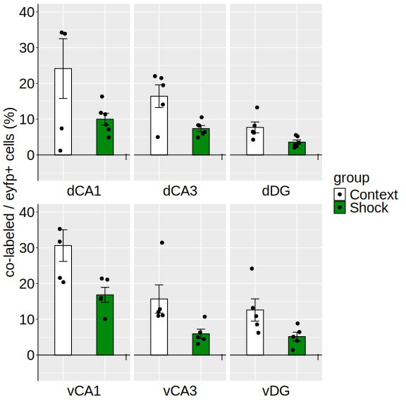
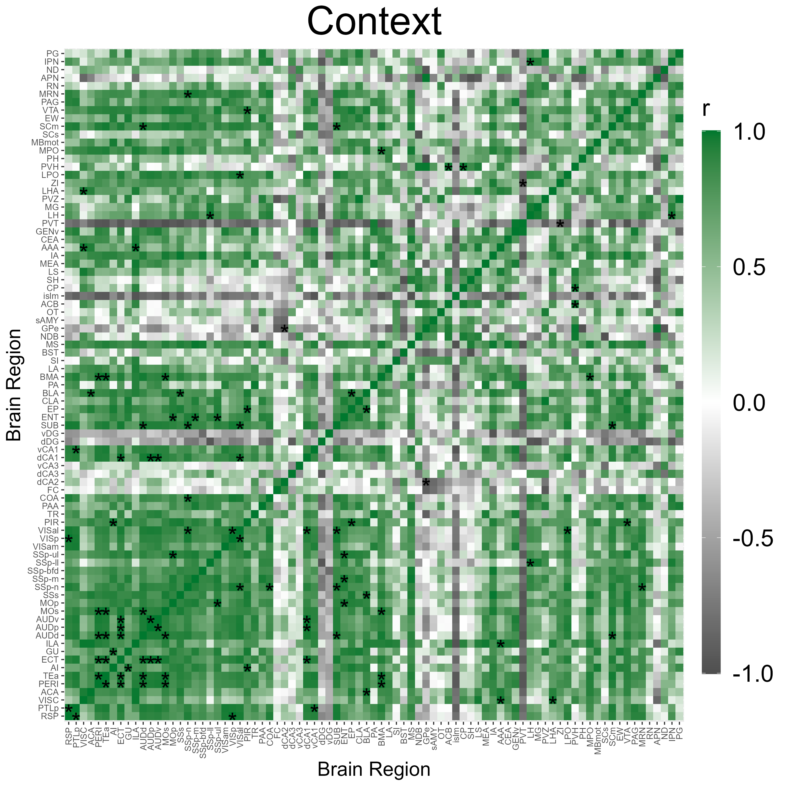
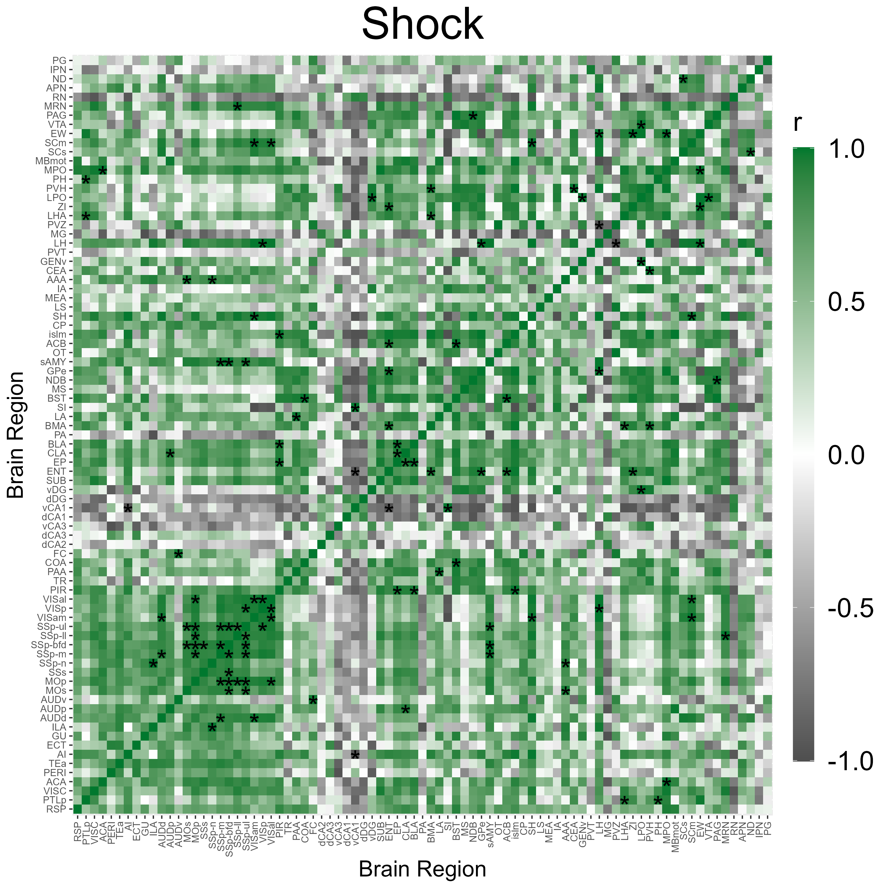
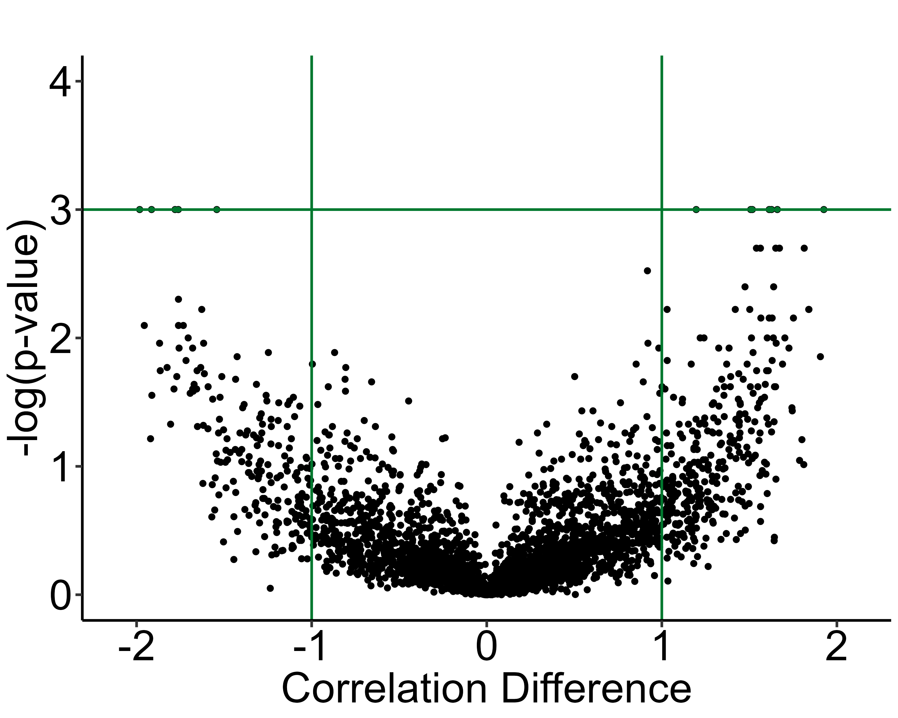
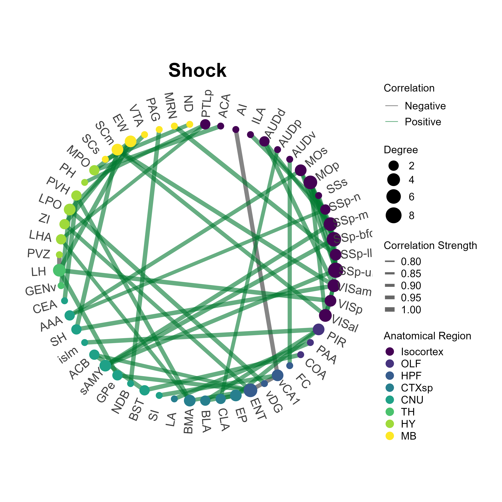

```{r setup, include=FALSE}
knitr::opts_chunk$set(echo = TRUE, eval = FALSE, warnings = FALSE)
```

# 1 Analysis Setup 

In this analysis tutorial we will load the learned helplessness dataset as an experiment object and walk through the analysis and visualization functions in SMARTR with it. You can download the learned helplessness dataset [here](https://osf.io/fhrxj)! Please see the accompanying paper for an in-depth explanation of the behavioral groups used in this experiment.

## 1.1 Load the libraries and data needed

```{r, results='hide', message=FALSE}
library(SMARTR)
# library(tidyverse)

# Install rstatix if it is not installed already
library(rstatix) 
```


Load the experiment object

```{r}
# Load the experiment data 
# Change to point to the experiment object downloaded
load("P:\\DENNYLABV\\Michelle_Jin\\Wholebrain pipeline\\LH_analysis\\learned_helplessness_experiment.RDATA")

# Change where the analysis folder is stored in the experiment object
# Edit the path below to point your own folder location
attr(lh, "info")$output_path <- "P:\\DENNYLABV\\Michelle_Jin\\Wholebrain pipeline\\LH_analysis" 

# print the experiment object to see what attributes are available
print(lh)
```

Print the names of the current data stored within the experiment object
```{r}
print(names(lh))
```

## 1.2 Combine the processed cell counts across all the mice. 


This concatenates the normalized regional cell count table from each mouse into one long dataframe. The `by` parameter is a list of the mouse attributes types you want to use to make analysis subgroups. For example, you would include `by = c('sex','age')` if you wanted to perform an analysis where the data is grouped by both males and females and age of the subjects. 

In our dataset `Shock` and `Context` are stored in the flexible generic attribute `group`, so we use that for the `by` variable.
```{r}
lh <- combine_cell_counts(lh, by = c('group'))

# print the name of stored data
print(names(lh))
```
There should now be a new list called `combined_normalized_counts`, where each element is a combined normalized cell count table per channel.


```{r}
# print the names of each channel cell count table
print(names(lh$combined_normalized_counts))
```

If there are specific regions you would like to exclude from your analysis, you can do so using the code below by entering region acronyms into the `toremove` vector. Here, we demonstrate removing the CA2 region.
```{r}
toremove <- c("CA2")

channels <- names(lh$combined_normalized_counts)
toremove <- c(toremove, SMARTR::get.sub.structure(toremove))
for (channel in channels){
  lh$combined_normalized_counts[[channel]] <- lh$combined_normalized_counts[[channel]] %>% dplyr::filter(!acronym %in% toremove)
}


```


## 1.3 Normalize colabelled counts by a particular  channel.
This is an optional step, but is particularly pertinent to those doing engram research. Sometimes we want to normalize the number of colabelled cells per region over the number of eYFP cells or c-Fos cells.


This allows users to gauge the fraction of cells "reactivated" from an original ensemble population (colabel+/eYFP+) or the number of reactivated cells as a proportion of the ensembles active during memory expression (colabel+/c-Fos+). We leave the choice to use either/both of these denominators to further analyze the data up to users.


```{r}
# Normalize the colabelled counts by a particular channel
lh <- normalize_colabel_counts(lh, denominator_channel = "eyfp")


# Uncomment the following line if you would like to also analyze colabelled cells normalized by c-Fos
# lh <- normalize_colabel_counts(lh, denominator_channel = "cfos")

# Print the names of each channel cell count table. New channels, where colabelled counts are normalized by 
# eyfp and/or cfos should be present.
print(names(lh$combined_normalized_counts))

```

The normalized colabelled counts can now be treated as an independent channel to analyze. 

## 1.4 Quality checking all region outlier counts across all  channels.


Details of these functions are covered in the mapping tutorial page. Removing all region outliers where counts above or below 2 standard deviations of the group mean are removed. This is evaluated in independently per channel.

```{r}
lh <- find_outlier_counts(lh, by = c("group"), n_sd = 2, remove = TRUE, log = TRUE)
```

Making sure a minimum of mice per group are represented in each region count.

```{r,  results='hide', message=TRUE}
lh <- enough_mice_per_group(lh, by = c("group"), min_n = 4, remove = TRUE, log = TRUE)
```

# 2 Analysis, statistical comparisons and visualization functions


It is helpful to now conceptualize analysis as composed of two parts: 1) One function performs data wrangling or analysis behind the scenes. 2) The second function is responsible for visualization, with built-in auto-export of figures.

This section will cover the analysis and transformation of data stored in the experiment object. Visualization/plotting, and export of the figures from these functions will be covered in section 3. The data output from these analyses will typically be stored in the experiment object if it is a `SMARTR` package function. Depending on the function, data can be auto-exported as a .csv file to the experiment output folder.


## 2.1 Exporting formatted regional counts list with multiple comparisons correction

Generating an a formatted regional counts list with an false discovery rate correction (FDR) can be performed with the `dplyr` and `rstatix` package functions. A user-friendly function to perform this flexibly with multiple groupings is planned to be incorporated later into the `SMARTR` package.

### Perform pairwise group comparisons in region counts and correct for multiple comparisons

The code below uses the FDR (Benjamini-Hochberg) method for adjusting the p-values for multiple comparisons. It is done separately for the eYFP, c-Fos, and colabel/eYFP channels.

```{r}
stats.eyfp <- lh$combined_normalized_counts$eyfp %>% group_by(acronym, name) %>%
  t_test(normalized.count.by.volume~group) %>% adjust_pvalue(method = "BH") %>%
    add_significance()
stats.cfos <- lh$combined_normalized_counts$cfos %>% group_by(acronym, name) %>%
  t_test(normalized.count.by.volume~group) %>% adjust_pvalue(method = "BH") %>%
    add_significance()
stats.colabel_over_eyfp <- lh$combined_normalized_counts$colabel_over_eyfp %>% group_by(acronym, name) %>%
  t_test(normalized.count.by.volume~group) %>% adjust_pvalue(method = "BH") %>%
    add_significance()
```

### Create summary table for eYFP

The following code pivots the stats table to long form to concatenate with the raw normalized counts
```{r, results='hide', message=FALSE, warning=FALSE}
wide_eyfp_norm_counts <- lh$combined_normalized_counts$eyfp %>% group_by(group, acronym, name) %>%
      summarise(mean.normalized.count.by.volume = mean(normalized.count.by.volume),
      sem.normalized.count.by.volume = SMARTR::sem(normalized.count.by.volume),
      n = n())
wide_eyfp_norm_counts <-  wide_eyfp_norm_counts %>% pivot_wider(names_from =  group, names_sep = ".", values_from = c(group, acronym, name, mean.normalized.count.by.volume, sem.normalized.count.by.volume, n)) %>% unnest() %>% rename(acronym = acronym.Context,
                          name = name.Context)

joined_eyfp_stats <- wide_eyfp_norm_counts %>% select(c(name, acronym, starts_with("mean"), starts_with("sem"))) %>% right_join(stats.eyfp, by = c("acronym", "name")) %>% select(-.y., -group1, -group2) %>% rename(n.Context = n1, n.Shock = n2)

file_name <- attr(lh, "info")$output_path %>% file.path("eyfp_regions_stats_table.csv")
write.csv(joined_eyfp_stats, file_name)
```

### Create summary table for c-Fos
```{r, results='hide', message=FALSE, warning=FALSE}
wide_cfos_norm_counts <- lh$combined_normalized_counts$cfos %>% group_by(group, acronym, name) %>%
      summarise(mean.normalized.count.by.volume = mean(normalized.count.by.volume),
      sem.normalized.count.by.volume = SMARTR::sem(normalized.count.by.volume),
      n = n())

wide_cfos_norm_counts <-  wide_cfos_norm_counts %>% pivot_wider(names_from =  group, names_sep = ".", values_from = c(group, acronym, name, mean.normalized.count.by.volume, sem.normalized.count.by.volume, n)) %>% unnest() %>% rename(acronym = acronym.Context,
                          name = name.Context)

joined_cfos_stats <- wide_cfos_norm_counts %>% select(c(name, acronym, starts_with("mean"), starts_with("sem"))) %>% right_join(stats.cfos, by = c("acronym", "name")) %>% select(-.y., -group1, -group2) %>% rename(n.Context = n1,
                                             n.Shock = n2)

file_name <- attr(lh, "info")$output_path %>% file.path("cfos_regions_stats_table.csv")
write.csv(joined_cfos_stats, file_name)
```

### Create summary table for colabel/eYFP channels
```{r, results='hide', message=FALSE, warning=FALSE}
wide_colabel_over_eyfp_norm_counts <- lh$combined_normalized_counts$colabel_over_eyfp %>% group_by(group, acronym, name) %>%
      summarise(mean.normalized.count.by.volume = mean(normalized.count.by.volume),
      sem.normalized.count.by.volume = SMARTR::sem(normalized.count.by.volume),
      n = n())

wide_colabel_over_eyfp_norm_counts <-  wide_colabel_over_eyfp_norm_counts %>% pivot_wider(names_from =  group, names_sep = ".", values_from = c(group, acronym, name, mean.normalized.count.by.volume, sem.normalized.count.by.volume, n)) %>%
      unnest() %>% rename(acronym = acronym.Context,
                          name = name.Context)

joined_colabel_over_eyfp_stats <- wide_colabel_over_eyfp_norm_counts %>% select(c(name, acronym, starts_with("mean"), starts_with("sem"))) %>% right_join(stats.colabel_over_eyfp, by = c("acronym", "name")) %>%
   select(-.y., -group1, -group2) %>% rename(n.Context = n1,
                                             n.Shock = n2)

file_name <- attr(lh, "info")$output_path %>% file.path("colabel_over_eyfp_regions_stats_table.csv")
write.csv(joined_colabel_over_eyfp_stats, file_name)
```


## 2.2 Get pairwise region correlations

The `get_correlations()` function is used to calculate pairwise Pearson correlations across all regions within an analysis group. This can be done for each channel. Later we can use this to generate a correlation heatmap. There is also an option to adjust for p-values using different multiple comparisons methods using the and a user-specified alpha value can also be applied to threshold significance. Check the function’s help page for more details.

Like previous functions, there is a `by` parameter so the analysis is focused on the correct grouping variables and values to stratify your data into groups. Because each heat map is calculated for one set of grouping variable values, these need to be specified with the `values` parameter. The following example will generated a correlation matrix for the eyfp channel independently for the Context and Shock groups. For this channel we have decided to use an alpha threshold of 0.005 for indicating significantly correlated regions. You can add additional channels to process, if you would like to use the same alpha across all channels.


```{r, results='hide', message=FALSE, warning=FALSE}

# Get correlations for the eyfp 
lh <- get_correlations(lh,
                       by = c("group"),
                       values = c("Context"),
                       channels = c("eyfp"),
                       p_adjust_method = "none",
                       alpha =  0.01)

lh <- get_correlations(lh,
                       by = c("group"),
                       values = c("Shock"),
                       channels = c("eyfp"),
                       p_adjust_method = "none",
                       alpha =  0.01)

```

Because the values of the grouping variables identify a unique analysis group, they are used to name the stored results in the experiment separated, with values separated by an "_". For example, in the analysis above, the results are stored as `Context` and `Shock`. If the analysis instead used the parameters ```by = c("sex", "group"), values = c("female", "AD")```, the results would be stored as a list under the name `female_AD`. We will refer to this as the `correlation_list_name`.

You can check all the `correlation_list_name` values you have by printing them:
```{r}
names(lh$correlation_list)

```


## 2.3 Permute pairwise region correlation differences between groups

We can compare the difference between pairwise region correlations between two different analysis groups using a permutation analysis. For this we’ll use the function `correlation_diff_permutation()`. This function requires you to have run `get_correlations()` for each analysis group and channel that you want to compare prior to using it.

It also allows you to specify the number of shuffles and the random seed number (for figure replication). Additionally, there is an option for multiple comparison’s adjustment; if applied, the previous adjustment from `get_correlations()` is not redundantly applied. Multiple comparisons adjustment will change the p-value that is later plotted in a volcano plot.

In the example below, we will compare the `Context` analysis group with the `Shock` group.

```{r, results='hide', message=FALSE, warning=FALSE}
lh <- correlation_diff_permutation(lh,
                                   correlation_list_name_1 = "Context",
                                   correlation_list_name_2 = "Shock",
                                   channels = c("eyfp"),
                                   p_adjust_method = "none",
                                   alpha = 0.01
                                   )
```

The results of the analysis can be exported with the function `export_permutation_results()`, which automatically saves into a folder generated for tables.

```{r}
export_permutation_results(lh, channels = "eyfp")
```


## 2.4 Create region networks with summary stats

Now we can move on to the process of automatically creating networks in R using the `create_networks()` function. This function is also contingent on running `get_correlations()` first because these networks are constructed on the correlation coefficents.

The `alpha` parameters specifies at which threshold a node is included in the networks based on p-values of pairwise-region correlation coefficients. To keep the edges include in the network the same as those indicated as significant in correlation heatmaps, set the `alpha` parameter to be the same.

```{r}

lh <- create_networks(lh,
                      correlation_list_name = "Context",
                      channels = c("eyfp"),
                      alpha = 0.01,
                      pearson_thresh = .9)
lh <- create_networks(lh,
                      correlation_list_name = "Shock",
                      channels = c("eyfp"),
                      alpha = 0.01,
                      pearson_thresh = .9)

```


After running this function,a network object for each channel per analysis group was created using tidygraph and they have been stored in our experiment object. We can access the data with `lh$networks$<network_name>` where network_name is identical to the `correlation_list_name` used to generate the network.

Now there are some network summary statistics that we can calculate using our network object. We will calculate them using the function `summarise_networks()`. This function is designed to summarize the stats of multiple networks at once if they are supplied to the parameter network_names.

The additional parameters `save_stats`, `save_degree_distribution`, `save_betweenness_distribution`, and `save_efficiency_distribution` are used to save the indicated network summary statistics as csv files in the experiment object folder. This is handy if you would prefer to graph these values externally in another software, such as Graphpad Prism instead of R.


```{r}
lh <- summarise_networks(lh,
                         channels = c("eyfp"),
                         network_names = c("Context", "Shock"),
                         save_stats = TRUE,
                         save_degree_distribution = TRUE,
                         save_betweenness_distribution = TRUE,
                         save_efficiency_distribution = TRUE)

```


# 3 Plotting & Visualization functions


All of this hard work will allow us to generate some beautiful plots. First there are some conventions to note for plotting functions. Unlike all the other package functions presented here, we will not be assigning the output of a plotting function to our experiment object. There is no return value for plotting functions. This is because no analysis is being done and the primary output that we want is either a graphics window, or an image saved to our output folder.

Almost all the functions will have parameters allowing you to specify the height and width in inches, the image extension (e.g. “.png”, “.jpg”), as well as colors (or color palettes) to save your plot as. Some of the functions will allow you to adjust the xlim and the ylim of your axes in order to fit the data or change the plot aesthestics by adding on your own ggplot() theme. Pull up the help pages to see what plot characteristics are customizable for each function!


## 3.1 Bar plot across all regions

To plot a broad overview of the counts per group across all mapped regions for each channel, we can use the `plot_normalized_counts` function. There are a variety of visualization parameters that are user-modifiable, including the bar colors per group. Note that currently, this function is only equipped to plot based on the generic `group` attribute rather than other attributes such as `age` or `sex`. 

### Plotting all regions with mapped eYFP counts
```{r}
# Chose the group colors for the eyfp channel to plot as a hexadecimal color code
eyfp.colors <- c(Context = "#FFFFFF", Shock = "#028A0F")

# ggplot2 theme object to specify specific aesthetic choices
plot_theme <- ggplot2::theme(plot.background = element_blank(),
                             panel.grid.major = element_blank(),
                             panel.grid.minor = element_blank(),
                             panel.border = element_blank(),
                             axis.line = element_line(color = 'black'),
                             legend.justification = c(0, 0),
                             legend.position = "inside",
                             legend.direction = "vertical",
                             axis.text.y = element_text(angle = 0,        # Adjust to change the angle of the region labels
                                                        hjust = 1,
                                                        size = 7,         # Adjust to change region label size
                                                        color = "black"),
                             axis.text.x = element_text(color = "black"),
                             strip.text.y = element_text(angle = 0,
                                                         margin = ggplot2::margin(t = 5, r = 5, b = 5, l = 5, unit = "pt")),
                             strip.placement = "outside",
                             strip.switch.pad.grid = unit(0.1, "in"))

# Plot a long region bar plot
plot_normalized_counts(e = lh,
                       channels = "eyfp",
                       by = "group",
                       values = list("Context", "Shock"),
                       colors = eyfp.colors,
                       title = NULL,
                       height = 11, # Specify the height of the saved plot in inches
                       width = 7.5, # Specify the  width of the save plot in inches
                       print_plot = TRUE,
                       flip_axis = TRUE,
                       save_plot = TRUE,
                       plot_theme = plot_theme,
                       facet_background_color = "#FFFFFF",
                       image_ext = ".png")
```


<figure>
  
  <figcaption><em>All mapped eYFP regions.</em> </figcaption>
</figure>


While the output of the following code chunks are not shown, this function can easily be called for the other channels.

#### Plotting all regions with mapped c-Fos counts

```{r}
# Chose the group colors for the cfos channel to plot as a hexadecimal color code
cfos.colors <- c(Context = "#FFFFFF", Shock = "#ff2a04")

# Plot a long region bar plot
plot_normalized_counts(e = lh,
                       channels = "cfos",
                       by = "group",
                       values = list("Context", "Shock"),
                       colors = cfos.colors,
                       title = NULL,
                       height = 11, # Specify the height of the saved plot in inches
                       width = 7.5, # Specify the  width of the save plot in inches
                       print_plot = TRUE,
                       flip_axis = TRUE,
                       save_plot = TRUE,
                       plot_theme = plot_theme,
                       facet_background_color = "#FFFFFF",
                       image_ext = ".png")

```

#### Plotting all regions with mapped colabel/eYFP counts
```{r}
# Chose the group colors for the colabel channel to plot as a hexadecimal color code
colabel.colors <- c(Context = "#FFFFFF", Shock = "#ffc845")

# Plot a long region bar plot
plot_normalized_counts(e = lh,
                       channels = "colabel_over_eyfp",
                       by = "group",
                       values = list("Context", "Shock"),
                       colors = colabel.colors,
                       unit_label = "co-labelled/EYFP+",
                       title = NULL,
                       height = 11, # Specify the height of the saved plot in inches
                       width = 7.5, # Specify the  width of the save plot in inches
                       print_plot = TRUE,
                       flip_axis = TRUE,
                       save_plot = TRUE,
                       plot_theme = plot_theme,
                       facet_background_color = "#e5f3e7",
                       image_ext = ".png")
```


## 3.2 Bar plot of normalized colabelled cells across user-specified regions

If you would like to quickly look at the percentage of normalized colabelled cells for a few specific regions, you can also use the `plot_percent_colabel` function.

This function is designed to take up to two mouse attributes to “map” to the respective graphs aesthetics of color and pattern to display on a bar plot. The `rois` parameter allows for selective plotting of specific regions and their subregions of interest. Just enter in a few acronyms as a string vector into the `rois` parameter. Below we will plot any regions that are subregions of the the Dentate Gyrus (DG) or the Cornu Ammonis (CA).  


```{r}

plot_percent_colabel(lh,
                     channel = "eyfp", # Channel to be used as denominator in counts
                     color_mapping = "group",
                     colors = eyfp.colors,
                     plot_individual = TRUE,
                     print_plot = TRUE,
                     save_plot = TRUE,
                     rois = c("DG", "CA"),
                     ylim = c(-5,40),
                     image_ext = ".svg")
```


<figure>
  
  <figcaption><em>Selectively mapped co-labelled regions normalized by eYFP counts.</em> </figcaption>
</figure>


```{r}
plot_percent_colabel(lh,
                     channel = "cfos", # Channel to be used as denominator in counts
                     color_mapping = "group",
                     colors = cfos.colors,
                     plot_individual = TRUE,
                     print_plot = TRUE,
                     save_plot = TRUE,
                     rois = c("DG", "CA"),
                     ylim = c(-5,40),
                     image_ext = ".svg")
```

<figure>
  
  <figcaption><em>Selectively mapped co-labelled regions normalized by c-Fos count.</em> </figcaption>
</figure>

> Note: The optional package ggpattern is required for mapping to the pattern aesthetic using the pattern_mapping parameter so make sure it is installed before running this function.


## 3.3 Correlation Heatmap Analysis

We can automatically plot heatmaps of the pairwise region correlations using the function `plot_correlation_heatmaps()`. Here we simply specify the name of the correlation list and the respective colors (in a hexadecimal string) corresponding to the channels that were specified in `get_correlations()`.


```{r}
p_list <- plot_correlation_heatmaps(lh,
                          channels = c("eyfp"),
                          correlation_list_name = "Context",
                          sig_color = "black",
                          sig_nudge_y = -0.5, # helps center and shift the significance asterisks
                          print_plot = FALSE,
                          colors = c( "#00782e"),
                          save_plot = TRUE)

p_list <- plot_correlation_heatmaps(lh,
                          channels = c("eyfp"),
                          correlation_list_name = "Shock",
                          sig_color = "black",
                          sig_nudge_y = -0.5,
                          print_plot = FALSE,
                          colors = c( "#00782e"),
                          save_plot = TRUE)
```


<figure>
  
  <figcaption><em>Regional correlation heatmap for eYFP activity in the Context group.</em> </figcaption>
</figure>
<figure>
  
  <figcaption><em>Regional correlation heatmap for eYFP activity in the Inescapable Shock group.</em> </figcaption>
</figure>


## 3.4 Visualization of correlation permutation analysis

`volcano_plot()` shows us a summary of the analysis results, and plots the pearson correlation coefficient differences (CT pearson coefficient - IS pearson coefficient) against their permuted p-values against a null distribution. 

The horizontal line represents the designated significance cutoff. The vertical lines plotted at +/- 1 allow for easier visualization of correlation differences that are large between groups. The colored dots in the upper right or left quadrants, including those which intersect the significance line, indicate the most significantly different regional connections between the groups, which have pearson correlation differences with a magnitude > 1.

```{r}
# User optional theme to define the aesthetics of the plot using ggplot2 syntax
plt_theme <- ggplot2::theme_classic() +
  theme(text = element_text(size = 34),
        line = element_line(size = 1.0),
        axis.line = element_line(colour = 'black', size = 1.0),
        plot.title = element_text(hjust = 0.5, size = 36),
        axis.ticks.length = unit(5.5,"points"),
        axis.text.x = element_text(colour = "black", size =34),
        axis.text.y = element_text(colour = "black", size = 34))

# Plot a volcano plot
volcano_plot(lh,
             permutation_comparison = "Context_vs_Shock",
             channels = c("eyfp"),
             colors =  c("#00782e"),
             height = 8,
             width = 10,
             title = "",
             print_plot = FALSE,
             ylim = c(0,4),
             point_size = 2,
             plt_theme = plt_theme)
```

<figure>
  
  <figcaption><em>Volcano plot for the eYFP channel.</em> </figcaption>
</figure>


Next, we can better visualize which actual region pairs are different between our two analysis groups and in which direction their correlation coefficients change with `parallel_coordinate_plot()`. Only region pairs from the volcano plot that are above the alpha level and have correlation coefficient differences greater than absolute one are included in this graph.


```{r}
# User optional theme to define the aesthetics of the plot using ggplot2 syntax
plt_theme <- ggplot2::theme_classic() +
  theme(text = element_text(size = 34),
        line = element_line(size = 1.0),
        axis.line = element_line(colour = 'black', size = 1.0),
        plot.title = element_text(hjust = 0.5, size = 36),
        axis.ticks.length = unit(5.5,"points"),
        axis.text.x = element_text(colour = "black", size =34),
        axis.text.y = element_text(colour = "black", size = 34)
  )


# Plot a parallel coordinate plot
parallel_coordinate_plot(lh,
                         permutation_comparison = "Context_vs_Shock",
                         channels = c( "eyfp"),
                         colors =  c("#00782e"),
                         x_label_group_1 = "CT",
                         x_label_group_2 = "IS",
                         height = 8,
                         width = 10,
                         print_plot = TRUE,
                         label_size = 6,
                         plt_theme= plt_theme
                         )
```

<figure>
  
  <figcaption><em>Parallel coordinate plot for the eYFP channel.</em> </figcaption>
</figure>


## 3.5 Plot network plots

The `plot_networks()` function  automatically plots the output of `create_networks()`. You must specify the name of the network you want to plot. There a some customizable features such as setting the edge color (taken as a hexadecimal string) for positively correlated connections. Additionally, you can further customize aesthetics by adding themes compatible with [ggraph](https://rdrr.io/cran/ggraph/man/theme_graph.html) and `ggplot2` themes. Below we will plot the networks for the eyfp channel in Context and Inescapable Shock groups.

```{r, eval = FALSE, message=TRUE, warnings=FALSE}

# Custom ggplot and ggraph themes 
graph_theme <- ggraph::theme_graph() + theme(plot.title = element_text(hjust = 0.5, size = 36),
                                             legend.text = element_text(size = 18),
                                             legend.title = element_text(size = 18))

plot_networks(lh,
              network_name ="Context",
              channels = c("eyfp"),
              title = "Context",
              degree_scale_limit = c(1,8),
              height = 10,
              width = 10,
              edge_color = "#00782e",
              label_size = 6,
              label_offset = 0.15)

plot_networks(lh,
              network_name = "Shock",
              channels = c("eyfp"),
              title = "Shock",
              degree_scale_limit = c(1,8),
              height = 10,
              width = 10,
              edge_color = "#00782e",
              label_size = 6,
              label_offset = 0.15)
```


<figure>
  
  <figcaption><em>eYFP activity network for the Context group.</em> </figcaption>
</figure>


<figure>
  
  <figcaption><em>eYFP activity network for the Inescapable Shock group.</em> </figcaption>
</figure>


