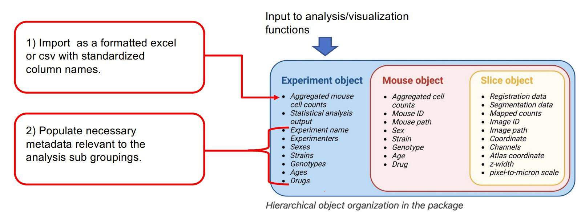
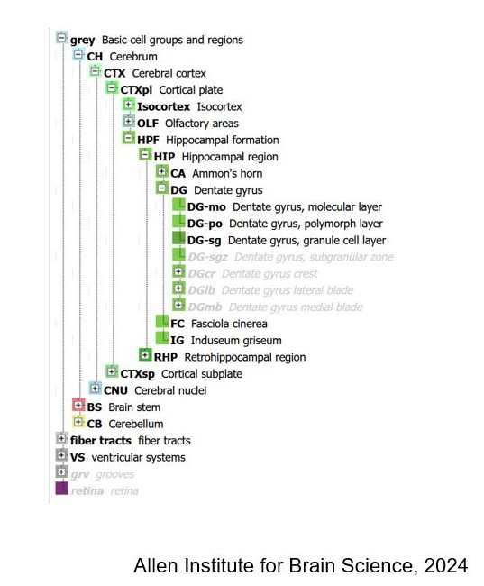

```{r setup, include=FALSE}
knitr::opts_chunk$set(echo = TRUE, eval = TRUE, warning=FALSE, message=FALSE, fig.show = 'inline')
```


# Formatting and downloading an example dataset


This vignette is guide for those interested in using SMARTTR's analysis and visualization functions for externally mapped brainwide datasets (typically from light sheet fluorescent microscopy or serial 2-photon microscopy). SMARTTR's hierarchical data storage makes it easy to import external datasets. The figure below shows that inputs to analysis and visualization functions are experiment objects. 

<figure>
  
  <figcaption><em>Where imported data lies in the object hiearchy.</em> </figcaption>
</figure>


In this tutorial we will read a novel unpublished LSFM dataset of c-Fos expression mapped to Yongsoo Kim lab's [unified atlas](https://kimlab.io/brain-map/atlas/). You can download the example scrambled dataset [here](https://osf.io/45qbj/)! 

> This dataset was provided as a courtesy from the Heshmati and Golden Labs from the University of Washington. However, the data grouping have been randomized for the `mouse_ID` and categorical variables such as `group` and `sex` compared to the original dataset.

## Data Formatting 

The downloaded .csv file also serves as an instruction template for formatting external datasets for importation.

<figure>
  
  <figcaption><em>Standardized formatting for importing external data.</em> </figcaption>
</figure>

Below we detail more about the column entries:

* `mouse_ID` - is a unique mouse id given. It can be a combination of letters and numbers. We recommend each mouse have a unique ID, without spaces.
* `group:sex` - a flexible number of columns to store categorical variables of relevance to most systems neuroscience experiments. Coding is case sensitive (e.g. "Female" vs "female"). The `group` category is the most generic, if none of the other categories fit. 
* `acronym` - ontology-specific region acronyms. Case sensitive. 
* `name` - ontology-specific long-form region names Case sensitive.
* `counts` - the absolute number of cells counted.
* `volume.mm3` - the volume of each region in mm^3^
* `normalized.count.by.volume` - the `counts` column divided by the `volume.mm3` column.


In this tutorial, we use the `group` variable to subdivide and analyze control mice, coded as `Control`, and inhaled anesthesia-exposed mice, coded as `Isoflurane`.


## Ontology support

Of note, the example dataset given is fully expanded in its nested ontology structure. This means there are subregions included, such as sublayers of the cortex, that can be folded into parent structures. 

Below we illustrate this nested structure for the Allen Mouse ontology. 

<figure>
  
  <figcaption><em>Nested ontology.</em> </figcaption>
</figure>

However, as part of a pre-processing step, it is highly recommended to fold smaller sub-regions into their larger parent region. While detailed sub-regional mapping is nice, there is a point where inclusion of each smaller sub-region begins to dilute out larger topological patterns in networks if instead they were folded them into their parent structure. SMARTTR includes folding options based on keyword matches to reduce the ontological "resolution". See the section "Clean redundant parent region data" for more information.


Currently the supported ontologies for folding are:

* The [Allen Mouse CCF](https://doi.org/10.1016/j.cell.2020.04.007) from the Allen Institute
* The [unified atlas](https://www.nature.com/articles/s41467-019-13057-w) from Yongsoo Kim's lab.

Please reach out and provide a full ontology tree if you would like another ontology supported!


# Data importation and pre-processing


## Import necessary dependencies

```{r}
## Packages to load
library(SMARTTR)
library(magrittr)
library(dplyr)
```


## Create an experiment object 
```{r}
# Creating an experiment object named "anesthesia" 
# Enter the channels parameter to distinguish which IEG(s) is/are stained.
# Note, the other categorical variables will be auto-imported from the dataset

anesthesia <- experiment(experiment_name = "anesthesia",
                         channels = "cfos",       # If you have more than one channel to import, set this to a character vector, e.g. c("cfos", "eyfp")
                         output_path = "P:\\DENNYLABV\\Michelle_Jin\\Wholebrain pipeline\\example_data\\example_experiment") #Set this to a path location where you want your figures/analysis output to save, e.g. "P:\\DENNYLABV\\Michelle_Jin\\experiment\\folder"
                         # output_path = tempdir()) #Set this to a path location where you want your figures/analysis output to save, e.g. "P:\\DENNYLABV\\Michelle_Jin\\experiment\\folder"


# Print experiment object to make sure metadata is up to date
print(anesthesia)

```


## Import and preprocess your externally mapped dataset

The `import_mapped_datasets()` is a helper function that makes it easy to import the formatted csv file into the proper location in the experiment object. 
It will also auto-detect the categorical variables used in the dataset. 

```{r}
anesthesia <- import_mapped_datasets(anesthesia, 
                                     normalized_count_paths = "P:\\DENNYLABV\\Michelle_Jin\\Wholebrain pipeline\\example_data\\anesthesia\\unified_ontology_unchecked.csv",
                                     show_col_types = FALSE)
print(anesthesia)


# If you have more than one channel data set to import, you would specify the normalized_count_paths 
# as a vector of named strings, with the names corresponding to the channel names.
# Uncomment the lines below:

# anesthesia <- import_mapped_datasets(anesthesia,
#                                      normalized_count_paths = c(cfos = "P:\\example\\path\\to\\first\\dataset.csv",
#                                                                 eyfp = "P:\\example\\path\\to\\second\\dataset.csv"))

```

### Quality check for matching ontology naming

This dataset uses the Kim Unified Ontology. The code below prints the first few entries of the Kim Unified Ontology.

```{r}
head(SMARTTR::ontology.unified)

```


SMARTTR requires that the ontology acronyms and full length region names of your dataset are perfectly matched with those of the stored ontology. Sometimes during the data exportation process, additional characters suchas as commas, semicolons, and spaces are erroneously introduced into acronyms or names. 

Here, we use the `check_ontology_coding function()` to correct any discrepencies and match to the internal ontologies stored in  SMARTTR. This step may take a minute if the dataset is quite large.

```{r}
ontology <- "unified"   # Set to "allen" if you are using the allen ontology
anesthesia <- check_ontology_coding(anesthesia, ontology = ontology)
```


### Cleaning based on regions to include

If there are a standardized set of regions you wish to analyze, to the exclusion of others, you may use the function `filter_regions()` to specify the acronyms of the base parent regions (which includes all subregions) you wish to analyze.

The example below shows the inclusion of the isocortex, olfactory bulb, hippocampal formation, cortical subplate, cerebral nuclei, thalamus, hypothalamus, midbrain, and hindbrain. Exclusion of the acronym, `CBL` automatically removes the cerebellum from the dataset.


```{r}
anesthesia <- filter_regions(anesthesia, 
                            base_regions =  c("Isocortex", "OLF", "HPF", "CTXsp", "CNU","TH", "HY", "MB", "HB"),
                            ontology = ontology)

```


### Clean redundant parent region data

Your dataset may contain redundant information because it includes counts at different "ontological" resolutions. A region of cortex (e.g. primary motor, M1) may be split into layer 1 (M1-1) , layer 2/3 (M1-2/3), etc. But total counts summed across all the layers (M1) may be entered as an additional row.  SMARTTR initially operates at the highest "resolution" and later on, can fold sub-regions into parent regions later. Therefore redundant counts from parent regions should be removed with `exclude_redundant_regions()`. 

```{r}
anesthesia <- exclude_redundant_regions(anesthesia, ontology = ontology)
```

Note: See also the function `check_redundant_parents()`, which detects redundant parents. It returns a named list with two elements `redundant_parents` (vector of acronyms) and `unique_acronyms` (vector of acronyms of subregions to retain)


### Simplify regions

To aid analysis interpretability, it is helpful to perform analysis at a certain ontology resolution. This is done by folding small sub-regions into their larger parent region based on exact keyword matches in their long-form name. This accomplished with the `simplify_cell_count()` function.

For example, inclusion of the keyword "layer" results in detection of all regions containing this word, which are then subfolded into their parent region. This is done recursively, until there are no regions containing this keyword in the dataset. See the help page for `simplify_cell_counts()` for the default recommended list of regions for the Allen CCF ontology. 

Below we create curated list of simplification keywords/phrases based on the analysis needs of this dataset and inspection of full names of the unified ontology (You can inspect the ontology [here.](https://osf.io/45qbj/)). The ones you use may be customized to suit your own needs.

```{r}
simplify_keywords <-c("layer", "zone",  "area 1", "area 2", "area 3", 
                      "subnucleus", "division", "Caudoputamen-", "Intergeniculate", "Pregeniculate", 
                      "Subgeniculate", "Island", "fields of Forel", "Cajal", "Darkschewitsch", 
                      "Precommissural", "cells", "stratum", "layer 1", "layer 2", 
                      "layer 2/3", "layer 3", "layer 4", "layer 5", "layer 6", 
                      "layer 6a", "layer 6b", "lucidum", "radiatum", "parvicellular", 
                      "anterolateral", "region", "mediolateral", "mediomedial", "dorsal part", 
                      "external part", "lateral part", "medial part", "ventral part", "posterior part", 
                      "central part", "Dorsomedial", "Dorsal lateral", "Dorsolateral", "Dorsomedial", 
                      "ventrolateral", "Lateral dorsal", "Laterodorsal", "Lateral posterior", "Medioventral", 
                      "Posterodorsal", "Posterolateral", "Ventromedidal", "binocular", "monocular", 
                      "tubercle", "intraamygdaloid", "Anteroventral", "core",  "shell",
                      "Ventral anterior", "Ventral intermediate", "dorsal area", "ventral area", "Anterodorsal", 
                      "Dorsal intermediate", "medial nucleus", "principal nucleus", "Lateroventral", "Rostral ventral", 
                      "dorsal cap", "fusiform", "Caudomedial", "medial nucleus", "Posteromedial", 
                      "Lateral superior", "Medial superior", "band",  "dorsal part", "VTA",  
                      "anterior division", "oral part", "lateral area", "medial area", "area 29 and 30", 
                      "Triangular nucleus", "Intermediate nucleus of the",   "Ventral nucleus of the", "Dorsal nucleus of the", "Recess of the", 
                      "Commisural nucleus of the",     "External cortex of the", "Dorsal Cortex of the", "Central nucleus of the", ", dorsal nucleus", 
                      "cortex 1", "cortex 2", "cortex 3", "prosomere 1 p", "pleoglial", 
                      "Lateral periaqueductal", "related", "prosomere 1", "Ventral cochlear", "Dorsal cochlear", 
                      "Cell bridges of the", "Commissural nucleus of the",    "Nucleus of the brachium of the",
                      "intermediate part", "Zona limitans", "Posterodorsal", "interfascicular part")

```

Below we simplify the counts by keywords chosen and recalculate the normalized counts

```{r}

# simplify the acronyms by the keyworks and recalculate the normalized counts
anesthesia <- simplify_cell_count(anesthesia, ontology = ontology, simplify_keywords = simplify_keywords, dont_fold = "")
```

## Cleaning regions to exclude

As another pre-processing step, you may want to exclude a custom list of regions. This may be due to your analysis needs or physical tissue preparation limitations. The function `exclude_by_acronym()` allows for this using a list of acronyms from supported ontologies (allen or unified). The function `exclude_by_keywords()` allows for this using a list of keywords included in the long-form name of a region. Below illustrates both of these functions as further cleaning steps.


Load and print list of chosen exclusion acronyms

```{r}
exclusion_acronyms <- c("fiber_tracts", "cm", "2n", "s5", "8cn", "sst", "cbf", "cbp", "scp", "mcp", "lfbs", 
                        "cc", "fmi", "cst", "lfbst", "eps", "epsc", "ts", "rs", "mfbs", "mfbc", "fxs", 
                         "fxpo", "hc", "st", "mfbsma", "mfbse", "VS", "3V", "4V", "drt")
```

Clean the dataset based on exclusion acronyms
```{r}
anesthesia <- exclude_by_acronym(anesthesia, acronyms = exclusion_acronyms, ontology = ontology)
```

Exclude based on keywords detected in the long-form name
```{r}
keywords_exclude <- c("nerve", "tract", "pineal gland", "	Area subpostrema")
anesthesia <-  exclude_by_keyword(anesthesia, keywords = keywords_exclude)
```


### Optional quality checking 

Add an additional threshold to remove all low activation region (predominately hindbrain) This step primarily removes small-area regions that are probably adding noise to the analysis. If a regions possesses 1 or less cfos counts, it is removed.
```{r}
thresh <- 1
anesthesia$combined_normalized_counts$cfos <- anesthesia$combined_normalized_counts$cfos %>% dplyr::filter(counts >= thresh)

```

> Please note that in this notebook, `%>%` is a pipe operator, and allows for stringing together multiple functions. This means the output of one function automatically is fed as a parameter into the next function.


Remove outliers for each subgroup.
```{r}
anesthesia <- find_outlier_counts(anesthesia, by = c("group"), n_sd = 2, remove = TRUE, log = TRUE)
```

Detect if each region is represented by a minimum number of mice (`min_n`) per subgroup (Control or Isoflurane groups).
```{r}
anesthesia <- enough_mice_per_group(anesthesia, by = c("group"), min_n = 4, remove = TRUE, log = TRUE)
```

### Checkpoint load default saved experiment object here
```{r}
save_experiment(anesthesia, timestamp = TRUE)
```

