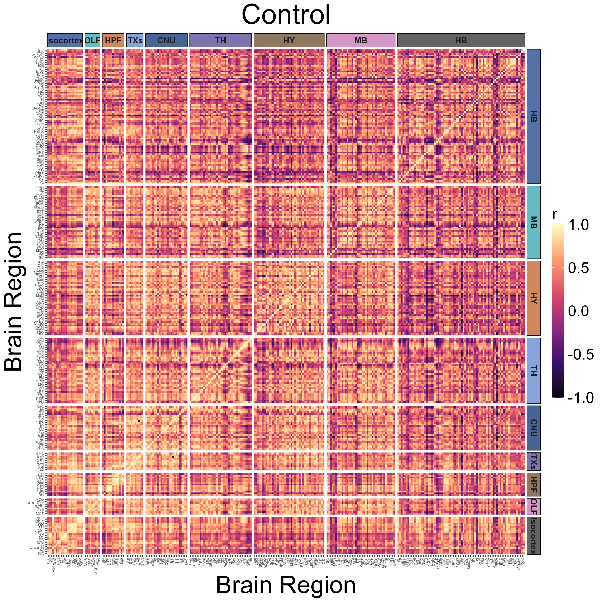

```{r setup, include=FALSE}
knitr::opts_chunk$set(echo = TRUE, eval = FALSE, warning=FALSE, message=FALSE, fig.show = 'inline')
```


# Formatting and downloading an example dataset


This vignette is guide for those interested in using SMARTTR's analysis and visualization functions for externally mapped brainwide datasets (typically from light sheet fluorescent microscopy or serial 2-photon microscopy). SMARTTR's hierarchical data storage makes it easy to import external datasets. The figure below shows that inputs to analysis and visualization functions are experiment objects. 

<figure>
  
  <figcaption><em>Where imported data lies in the object hiearchy.</em> </figcaption>
</figure>


In this tutorial we will read a novel unpublished LSFM dataset of c-Fos expression mapped to Yongsoo Kim lab's [unified atlas](https://kimlab.io/brain-map/atlas/). You can download the example scrambled dataset [here](https://osf.io/45qbj/)! 

> This dataset was provided as a courtesy from the Heshmati and Golden Labs from the University of Washington. However, the data grouping have been randomized for the `mouse_ID` and categorical variables such as `group` and `sex` compared to the original dataset.

## Data Formatting 

The downloaded .csv file also serves as an instruction template for formatting external datasets for importation.

<figure>
  
  <figcaption><em>Standardized formatting for importing external data.</em> </figcaption>
</figure>

Below we detail more about the column entries:

* `mouse_ID` - is a unique mouse id given. It can be a combination of letters and numbers. We recommend each mouse have a unique ID, without spaces.
* `group:sex` - a flexible number of columns to store categorical variables of relevance to most systems neuroscience experiments. Coding is case sensitive (e.g. "Female" vs "female"). The `group` category is the most generic, if none of the other categories fit. 
* `acronym` - ontology-specific region acronyms. Case sensitive. 
* `name` - ontology-specific long-form region names Case sensitive.
* `counts` - the absolute number of cells counted.
* `volume.mm3` - the volume of each region in mm^3^
* `normalized.count.by.volume` - the `counts` column divided by the `volume.mm3` column.


In this tutorial, we use the `group` variable to subdivide and analyze control mice, coded as `Control`, and inhaled anesthesia-exposed mice, coded as `Isoflurane`.


## Ontology support

Of note, the example dataset given is fully expanded in its nested ontology structure. This means there are subregions included, such as sublayers of the cortex, that can be folded into parent structures. 

Below we illustrate this nested structure for the Allen Mouse ontology. 

<figure>
  
  <figcaption><em>Nested ontology.</em> </figcaption>
</figure>

However, as part of a pre-processing step, it is highly recommended to fold smaller sub-regions into their larger parent region. While detailed sub-regional mapping is nice, there is a point where inclusion of each smaller sub-region begins to dilute out larger topological patterns in networks if instead they were folded them into their parent structure. SMARTTR includes folding options based on keyword matches to reduce the ontological "resolution". See the section "Clean redundant parent region data" for more information.


Currently the supported ontologies for folding are:

* The [Allen Mouse CCF](https://doi.org/10.1016/j.cell.2020.04.007) from the Allen Institute
* The [unified atlas](https://www.nature.com/articles/s41467-019-13057-w) from Yongsoo Kim's lab.

Please reach out and provide a full ontology tree if you would like another ontology supported!


# Data importation and pre-processing


## Import necessary dependencies

```{r}
## Packages to load
library(SMARTTR)
library(magrittr)
library(dplyr)
```

## Create an experiment object 
```{r}
# Creating an experiment object named "anesthesia" 
# Enter the channels parameter to distinguish which IEG(s) is/are stained.
# Note, the other categorical variables will be auto-imported from the dataset

anesthesia <- experiment(experiment_name = "anesthesia",
                         channels = "cfos",       # If you have more than one channel to import, set this to a character vector, e.g. c("cfos", "eyfp")
                         output_path = "P:\\DENNYLABV\\Michelle_Jin\\Wholebrain pipeline\\example_data\\example_experiment") #Set this to a path location where you want your figures/analysis output to save, e.g. "P:\\DENNYLABV\\Michelle_Jin\\experiment\\folder"
                         # output_path = tempdir()) #Set this to a path location where you want your figures/analysis output to save, e.g. "P:\\DENNYLABV\\Michelle_Jin\\experiment\\folder"


# Print experiment object to make sure metadata is up to date
print(anesthesia)

```


## Import and preprocess your externally mapped dataset

The `import_mapped_datasets()` is a helper function that makes it easy to import the formatted csv file into the proper location in the experiment object. 
It will also auto-detect the categorical variables used in the dataset. 

```{r}
anesthesia <- import_mapped_datasets(anesthesia, 
                                     # normalized_count_paths = "P:\\DENNYLABV\\Michelle_Jin\\Wholebrain pipeline\\example_data\\anesthesia\\unified_ontology_unchecked.csv",
                                     normalized_count_paths = "P:\\DENNYLABV\\Michelle_Jin\\Wholebrain pipeline\\example_data\\anesthesia\\anesthesia_reformatted_ontology_unchecked.csv",
                                     show_col_types = FALSE)
print(anesthesia)


# If you have more than one channel data set to import, you would specify the normalized_count_paths 
# as a vector of named strings, with the names corresponding to the channel names.
# Uncomment the lines below:

# anesthesia <- import_mapped_datasets(anesthesia,
#                                      normalized_count_paths = c(cfos = "P:\\example\\path\\to\\first\\dataset.csv",
#                                                                 eyfp = "P:\\example\\path\\to\\second\\dataset.csv"))

```

### Quality check for matching ontology naming

This dataset uses the Kim Unified Ontology. The code below prints the first few entries of the Kim Unified Ontology.

```{r}
head(SMARTTR::ontology.unified)
```

SMARTTR requires that the ontology acronyms and full length region names of your dataset are perfectly matched with those of the stored ontology. Sometimes during the data exportation process, additional characters suchas as commas, semicolons, and spaces are erroneously introduced into acronyms or names. 

Here, we use the `check_ontology_coding function()` to correct any discrepencies and match to the internal ontologies stored in  SMARTTR. This step may take a minute if the dataset is quite large.

```{r}
ontology <- "unified"   # Set to "allen" if you are using the allen ontology
anesthesia <- check_ontology_coding(anesthesia, ontology = ontology)
```


### Cleaning based on regions to include

If there are a standardized set of regions you wish to analyze, to the exclusion of others, you may use the function `filter_regions()` to specify the acronyms of the base parent regions (which includes all subregions) you wish to analyze.

The example below shows the inclusion of the isocortex, olfactory bulb, hippocampal formation, cortical subplate, cerebral nuclei, thalamus, hypothalamus, midbrain, and hindbrain. Exclusion of the acronym, `CBL` automatically removes the cerebellum from the dataset.


```{r}
anesthesia <- filter_regions(anesthesia, 
                            base_regions =  c("Isocortex", "OLF", "HPF", "CTXsp", "CNU","TH", "HY", "MB", "HB"),
                            ontology = ontology)
```


### Clean redundant parent region data

Your dataset may contain redundant information because it includes counts at different "ontological" resolutions. A region of cortex (e.g. primary motor, M1) may be split into layer 1 (M1-1) , layer 2/3 (M1-2/3), etc. But total counts summed across all the layers (M1) may be entered as an additional row.  SMARTTR initially operates at the highest "resolution" and later on, can fold sub-regions into parent regions later. Therefore redundant counts from parent regions should be removed with `exclude_redundant_regions()`. 

```{r}
anesthesia <- exclude_redundant_regions(anesthesia, ontology = ontology)
```

Note: See also the function `check_redundant_parents()`, which detects redundant parents. It returns a named list with two elements `redundant_parents` (vector of acronyms) and `unique_acronyms` (vector of acronyms of subregions to retain)


### Simplify regions

To aid analysis interpretability, it is helpful to perform analysis at a certain ontology resolution. This is done by folding small sub-regions into their larger parent region based on exact keyword matches in their long-form name. This accomplished with the `simplify_cell_count()` function.

For example, inclusion of the keyword "layer" results in detection of all regions containing this word, which are then subfolded into their parent region. This is done recursively, until there are no regions containing this keyword in the dataset. See the help page for `simplify_cell_counts()` for the default recommended list of regions for the Allen CCF ontology. 

Below we create curated list of simplification keywords/phrases based on the analysis needs of this dataset and inspection of full names of the unified ontology (You can inspect the ontology [here.](https://osf.io/45qbj/)). The ones you use may be customized to suit your own needs.

```{r}
simplify_keywords <-c("layer", "zone",  "area 1", "area 2", "area 3", 
                      "subnucleus", "division", "Caudoputamen-", "Intergeniculate", "Pregeniculate", 
                      "Subgeniculate", "Island", "fields of Forel", "Cajal", "Darkschewitsch", 
                      "Precommissural", "cells", "stratum", "layer 1", "layer 2", 
                      "layer 2/3", "layer 3", "layer 4", "layer 5", "layer 6", 
                      "layer 6a", "layer 6b", "lucidum", "radiatum", "parvicellular", 
                      "anterolateral", "region", "mediolateral", "mediomedial", "dorsal part", 
                      "external part", "lateral part", "medial part", "ventral part", "posterior part", 
                      "central part", "Dorsomedial", "Dorsal lateral", "Dorsolateral", "Dorsomedial", 
                      "ventrolateral", "Lateral dorsal", "Laterodorsal", "Lateral posterior", "Medioventral", 
                      "Posterodorsal", "Posterolateral", "Ventromedidal", "binocular", "monocular", 
                      "tubercle", "intraamygdaloid", "Anteroventral", "core",  "shell",
                      "Ventral anterior", "Ventral intermediate", "dorsal area", "ventral area", "Anterodorsal", 
                      "Dorsal intermediate", "medial nucleus", "principal nucleus", "Lateroventral", "Rostral ventral", 
                      "dorsal cap", "fusiform", "Caudomedial", "medial nucleus", "Posteromedial", 
                      "Lateral superior", "Medial superior", "band",  "dorsal part", "VTA",  
                      "anterior division", "oral part", "lateral area", "medial area", "area 29 and 30", 
                      "Triangular nucleus", "Intermediate nucleus of the",   "Ventral nucleus of the", "Dorsal nucleus of the", "Recess of the", 
                      "Commisural nucleus of the",     "External cortex of the", "Dorsal Cortex of the", "Central nucleus of the", ", dorsal nucleus", 
                      "cortex 1", "cortex 2", "cortex 3", "prosomere 1 p", "pleoglial", 
                      "Lateral periaqueductal", "related", "prosomere 1", "Ventral cochlear", "Dorsal cochlear", 
                      "Cell bridges of the", "Commissural nucleus of the",    "Nucleus of the brachium of the",
                      "intermediate part", "Zona limitans", "Posterodorsal", "interfascicular part")

```

Below we simplify the counts by keywords chosen and recalculate the normalized counts

```{r}
# simplify the acronyms by the keyworks and recalculate the normalized counts
anesthesia <- simplify_cell_count(anesthesia, ontology = ontology, simplify_keywords = simplify_keywords, dont_fold = "")
```

## Cleaning regions to exclude

As another pre-processing step, you may want to exclude a custom list of regions. This may be due to your analysis needs or physical tissue preparation limitations. The function `exclude_by_acronym()` allows for this using a list of acronyms from supported ontologies (allen or unified). The function `exclude_by_keywords()` allows for this using a list of keywords included in the long-form name of a region. Below illustrates both of these functions as further cleaning steps.


Load and print list of chosen exclusion acronyms

```{r}
exclusion_acronyms <- c("fiber_tracts", "cm", "2n", "s5", "8cn", "sst", "cbf", "cbp", "scp", "mcp", "lfbs", 
                        "cc", "fmi", "cst", "lfbst", "eps", "epsc", "ts", "rs", "mfbs", "mfbc", "fxs", 
                         "fxpo", "hc", "st", "mfbsma", "mfbse", "VS", "3V", "4V", "drt")
```

Clean the dataset based on exclusion acronyms
```{r}
anesthesia <- exclude_by_acronym(anesthesia, acronyms = exclusion_acronyms, ontology = ontology)
```

Exclude based on keywords detected in the long-form name
```{r}
keywords_exclude <- c("nerve", "tract", "pineal gland", "	Area subpostrema")
anesthesia <-  exclude_by_keyword(anesthesia, keywords = keywords_exclude)
```


### Optional quality checking 

Add an additional threshold to remove all low activation region (predominately hindbrain) This step primarily removes small-area regions that are probably adding noise to the analysis. If a regions possesses 1 or less cfos counts, it is removed.
```{r}
thresh <- 1
anesthesia$combined_normalized_counts$cfos <- anesthesia$combined_normalized_counts$cfos %>% dplyr::filter(counts >= thresh)

```

> Please note that in this notebook, `%>%` is a pipe operator, and allows for stringing together multiple functions. This means the output of one function automatically is fed as a parameter into the next function.


Remove outliers for each subgroup.
```{r}
anesthesia <- find_outlier_counts(anesthesia, by = c("group"), n_sd = 2, remove = TRUE, log = TRUE)
```

Detect if each region is represented by a minimum number of mice (`min_n`) per subgroup (Control or Isoflurane groups).
```{r}
anesthesia <- enough_mice_per_group(anesthesia, by = c("group"), min_n = 4, remove = TRUE, log = TRUE)
```

### Checkpoint load default saved experiment object here
```{r}
save_experiment(anesthesia, timestamp = TRUE)
```


# Representative dataset analysis 

In the following section, we will expand on or highlight more analyses with this dataset that are not as covered in-depth in the [Example analysis notebook](../articles/Part4.Example_Analysis_Notebook.html). We recommend reading section 4 first, as less detail will be described here for functions already mentioned there.

Additionally, some of these analysis features are only available through the development version of SMARTTR, installed directly from Github. As checks and testing are incorporated for these,
these functions will be updated in the latest bundled installation of SMARTTR.

> The example results images presented in this section are from the actual dataset and will look different from the results of the scrambled example dataset. Once the manuscript is fully available, the unscrambled dataset will be available for download and results will resemble those in this section.

## Get regional cross correlations and plot them as a heatmap
The `get_correlations()` function is used to calculate pairwise Pearson correlations across all regions within an analysis group. 
```{r}
# Groups to iterate through and their corresponding plotting labels
groups <- c("Control", "Isoflurane")

# Calculate correlations for each group
for (i in 1:length(groups)){
  print(groups[[i]])
  anesthesia <- get_correlations(anesthesia,
                                by = "group",
                                values = groups[[i]],
                                p_adjust_method = "none",
                                channels = "cfos",
                                ontology = "unified",
                                alpha = 0.00001)
}

```
There are a few global aesthetic parameters that will be used repeatedly across plotting functions, so they are setup below for use:
```{r}
# Setting up aesthetic color choices
group.colors <- c(Isoflurane="#04C3C3", Control = "#BF1F1F")
anatomical.colors <- c(Isocortex = "#5571a9", OLF = "#64bdc4", HPF = "#d2875b", CTXsp = "#87a3db", 
                       CNU = "#466496", TH = "#7e72af", HY = "#8e7960",  MB = "#d796c8", HB = "#646464")
```


Plotting a regional correlation heatmap for the Control group. Note that setting the `colors` parameter to NULL results in the viridis color scale. Figures will autosave at [experiment folder path]/[Figures].
```{r}
# Option to use custom ggplot2 theme to fine-tune aesthetics
theme.hm <- ggplot2::theme(axis.text.x = element_text(hjust = 1, vjust = 0.5, angle = 90, size = 5),
                          axis.text.y = element_text(vjust = 0.5, size = 5),
                          plot.title = element_text(hjust = 0.5, size = 40),
                          axis.title = element_text(size = 35),
                          legend.text = element_text(size = 22),
                          legend.key.height = unit(50, "pt"),
                          legend.title = element_text(size = 22),
                          panel.spacing = unit(0.2, "lines"),
                          strip.text.x = element_text(angle = 0, hjust = 0.5, vjust = 0.5, size = 12, face="bold"),
                          strip.text.y = element_text(angle = 270,  hjust = 0.5, vjust = 0.5, size = 12, face="bold"),
                          strip.placement = "outside")

# Plotting heatmap.
plot_correlation_heatmaps(anesthesia,
                          channels = "cfos",
                          correlation_list_name = "Control",
                          sig_color = "black",
                          sig_nudge_y = -0.8,
                          sig_size = 4,
                          plot_title = "Control",
                          print_plot = FALSE,
                          ontology = "unified",
                          colors = NULL,  # Uses viridis scale if NULL
                          height = 12,
                          width = 12,
                          strip_background_colors = anatomical.colors,
                          theme.hm = theme.hm,
                          image_ext = ".png",
                          save_plot = TRUE)
```

<figure>
  
  <figcaption><em>Heatmap of regional correlations for the Control group. Black astericks represent significant correlations based on user-set alpha value..</em> </figcaption>
</figure>


```{r}
plot_correlation_heatmaps(anesthesia,
                                  channels = "cfos",
                                  correlation_list_name = "Isoflurane",
                                  sig_color = "black",
                                  sig_nudge_y = -0.8,
                                  sig_size = 4,
                                  plot_title = "Isoflurane",
                                  print_plot = FALSE,
                                  ontology = "unified",
                                  colors = NULL, 
                                  height = 12,
                                  width = 12,
                                  strip_background_colors = anatomical.colors,
                                  theme.hm = theme.hm,
                                  image_ext = ".png",
                                  save_plot = TRUE)
```


<figure>
  
  <figcaption><em>Heatmap of regional correlations for the Isoflurane group. Black astericks represent significant correlations based on user-set alpha value..</em> </figcaption>
</figure>


## Plotting representative joined networks using a proportional threshold

We can plot the concatenation of two networks of interest using the `create_joined_networks()` and `plot_joined_networks()` functions. 
We can make sure the networks have matching edge density using the `proportional_thresh` parameter (edge proportion 3.15%)

```{r, eval=FALSE}
anesthesia <- create_joined_networks(anesthesia, 
                                     correlation_list_names = c("Control", "Isoflurane"),
                                     channels = "cfos",
                                     proportional_thresh = 0.0315,
                                     ontology = ontology)

# Creating ggraph theme to apply to the networks to fine tune graphics
graph_theme <- ggraph::theme_graph() + theme(plot.title = element_text(hjust = 0.5, size = 100, face = "plain"),
                                             legend.text = element_text(size = 55),
                                             legend.title = element_text(size = 60),
                                             panel.background = element_rect(fill='transparent', color = "transparent"),
                                             plot.background = element_rect(fill='transparent', color= "transparent"),
                                             legend.background = element_rect(fill='transparent', color = "transparent"))

# Group labels for plotting the edges
group.labels <- c(Control = "Control", Isoflurane = "Isoflurane")

# Plotting the network. The figure will autosave in the Figures output folde of the experiment
p_list <- plot_joined_networks(anesthesia,
                               correlation_list_names = c("Control", "Isoflurane"),
                               channels = "cfos",
                               absolute_weight = TRUE,
                               title = "Control + Isoflurane",
                               edge_colors = group.colors,
                               edge_color_labels = group.labels,
                               degree_scale_limit = c(1,45),
                               correlation_edge_width_limit = c(0.8, 1.0),
                               height = 30,
                               width = 30,
                               label_size = 10,
                               label_offset = 0.08,
                               anatomical.colors = anatomical.colors,
                               transparent_edge_group1 = FALSE,
                               transparent_edge_group2 = FALSE,
                               edge_thickness_range = c(1,5),
                               node_size_range = c(1, 18),
                               graph_theme = graph_theme,
                               image_ext = ".png")

```

<figure>
  
  <figcaption><em>Joined Control and Isoflurane networks.</em> </figcaption>
</figure>


## Generate null networks

Sometimes it is informative to examine the properties of each empirical network in comparison to null networks with some characteristics controlled such as average degree.
We can do so with the `rewire_network()` function. The current supported algorithm used is [Maslov-Sneppen](https://www.science.org/doi/10.1126/science.1065103) rewiring, 
which preserves degree sequence of each empirical network. The `n_rewires` parameter determines the number of rewirings which occur to generate each null network. The general recommended
number of rewirings corresponds to the size of each empirical network (no. edges) times 100. The `n_networks` parameter determines the number of null networks to generate. The default is 
to create 100 null networks.

```{r}

## Calculate null summaries
null_nodes_p1 <- rewire_network(anesthesia,
                          channels = "cfos",
                         network_name = "Control",
                         n_rewires = igraph::gsize(anesthesia$networks$Control$cfos) * 100,
                         return_graphs = FALSE)

null_nodes_p2 <- rewire_network(anesthesia,
                          channels = "cfos",
                         network_name = "Isoflurane",
                         n_rewires = igraph::gsize(anesthesia$networks$Isoflurane$cfos) * 100,
                         return_graphs = FALSE)
```


The following code averages node-level properties across all null networks generated. It then summarizes global network level properties by averaging the mean node-level properties.
```{r}

null_network_summary <- summarize_null_networks(null_nodes_list = list(null_nodes_p1,
                                                                       null_nodes_p2),
                                                network_names = c("Control", "Isoflurane"),
                                                channel = "cfos")

head(null_network_summary$global_summary)
```


We can export the node-level and global level summaries of the null networks to the experiment folder using the code below:
```{r}
write.csv(null_network_summary$global_summary ,  file = file.path(attr(anesthesia, "info")$output, "tables", "df_null_network_summaries_global_cfos .csv"))  
write.csv(null_network_summaries$node_summary ,  file = file.path(attr(anesthesia, "info")$output, "tables", "df_null_network_summaries_nodes_cfos .csv"))
```


## Permutation analysis 

We can perform a permutation analysis to create a null distribution of Pearson correlation values for each regional correlation. The following code generates null distributions between the Control and Isoflurane groups after 10,000 label shuffles.
```{r}
anesthesia <- correlation_diff_permutation(anesthesia,
                                 correlation_list_name_1 = "Control",
                                 correlation_list_name_2 = "Isoflurane",
                                 channels = "cfos",
                                 n_shuffle = 10000,
                                 p_adjust_method = "none",
                                 alpha = 0.001)
```
The results of the permutation analysis can be automatically exported with the following code:
```{r}
export_permutation_results(anesthesia, channels = "cfos", ontology = "unified")

```

You can save a separate csv of the permutation results that are filtered only for significant values useing the `filter_significant` parameter.

```{r}
export_permutation_results(anesthesia, channels = "cfos", ontology = "unified", filter_significant = TRUE)
```


> Please note that figures may be very similar across different permutation runs, but not identical due to different random seeds. 

The follow code plots a volcano plot to highlight the major correlation differences in both direction and magnitude. Red dots in the upper left quadrant are correlation
differences where Control > Isoflurane and those in the upper right quadrant are correlation differences where  Control < Isoflurane.
```{r}
# Choose the color of the plot with a hexadecimal string
vp_color <- "#BF1F1F"

# User optional theme to define the aesthetics of the plot using ggplot2 syntax
plt_theme_vp <- ggplot2::theme_classic() +
  theme(text = element_text(size = 34),
        line = element_line(size = 1.0),
        axis.line = element_line(colour = 'black', size = 1.0),
        plot.title = element_text(hjust = 0.5, size = 36),
        axis.ticks.length = unit(5.5,"points"),
        axis.text.x = element_text(colour = "black", size =34),
        axis.text.y = element_text(colour = "black", size = 34))

# Plot a volcano plot
plots <- volcano_plot(anesthesia,
                      permutation_comparison = "Control_vs_Isoflurane",
                      channels = "cfos",
                      colors = vp_color,
                      height = 8,
                      width = 8, 
                      title = "Control vs Isoflurane",
                      print_plot = FALSE,
                      ylim = c(0,5),
                      point_size = 2,
                      plt_theme = plt_theme_vp)
```

<figure>
  
  <figcaption><em>Volcano plot.</em> </figcaption>
</figure>


## Permuted correlation difference networks

We can better highlight the individual significant region correlations differences, and the overall structure of the regions they connect, by plotting them as a permuted correlation difference
network.

We first create this network with the `create_perm_diff_network()` function. This function also supports the possibility for community detection using the `community_detection_function` parameter,
which defaults to the `tidygraph::group_fast_greedy` [method](https://tidygraph.data-imaginist.com/reference/group_graph.html).

```{r}
anesthesia <- create_perm_diff_network(anesthesia, permutation_group = "Control_vs_Isoflurane", channel = "cfos", ontology = "unified", p_value_thresh = 0.001, weights = NULL)
```


We can then plot this network using the `plot_perm_diff_network()` function. The `mark_hull` parameter allows for the visualization of communities detected,  plotted as 
a colored polygon.

```{r}
graph_theme <- ggraph::theme_graph() + theme(plot.title = element_text(hjust = 0.5,size = 20),
                                             legend.text = element_text(size = 30),
                                             legend.title = element_text(size = 30))

p <- plot_perm_diff_network(anesthesia, 
                            permutation_group = "Control_vs_Isoflurane", 
                            channel = "cfos",
                            pos_edge_legend_label = "Iso > Ctrl",
                            neg_edge_legend_label = "Iso < Ctrl",
                            layout = "fr", 
                            mark_hull=TRUE,  
                            node_text_size = 14,
                            seed = 15, 
                            width = 20, 
                            height = 20, 
                            graph_theme = graph_theme,  
                            anatomical.colors = anatomical.colors,
                            image_ext = ".png")
```

<figure>
  
  <figcaption><em>Permutated correlation difference network.</em> </figcaption>
</figure>


