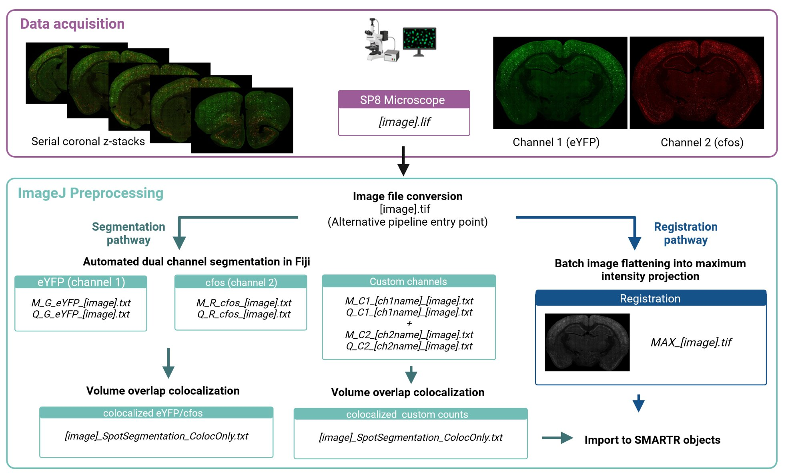
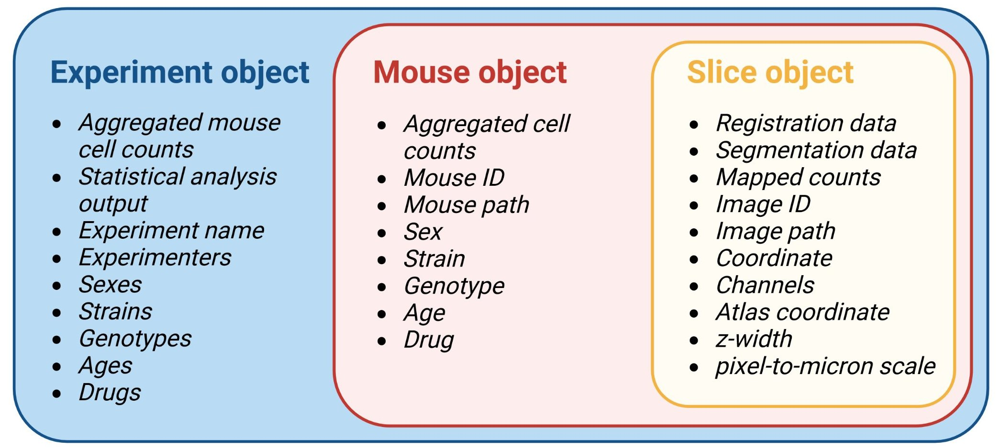

```{r, include = FALSE}
options(width = 300, rmarkdown.html_vignette.check_title = FALSE)
knitr::opts_chunk$set(
  collapse = TRUE,
  comment = "#>",
  echo = TRUE, 
  eval = FALSE
)
```

`SMARTTR` stands for **s**imple **m**ulti-ensemble **a**tlas **r**egistration and s**t**atistical **t**esting in **R**. It is also a self-referential play  on a previous package developed as an extension to `wholebrain` called `SMART`.`SMARTTR` interfaces with some functions from both of these packages underneath the hood.


`SMARTTR` encapsulates the process of registration and performs downstream analysis. Prior to this, the imaging data must be pre-processed and cells are separately segmented in ImageJ/FIJI. We have a separate, in-depth article on our imaging and pre-processing approach, parameters, and segmentation process. We provide links to an example image to run though the pre-processing and segmentation. There is also a separate in-depth tutorial article for SMARTTR using this example image.
This page provides installation instructions and a broad explanation of the central package organization around data objects

<figure>
  
  <figcaption><em>Imaging, segmentation, and pre-processing pipeline</em> </figcaption>
</figure>

<br>  


# Installation 

## 1.1 Install R 

We recommend installing R version 3.6 for compatibility with the `wholebrain` package for registration and mapping. You can download it [here](https://cran-archive.r-project.org/bin/windows/base/old/3.6.3/) for Windows.

However, users who only need access to analysis and visualization capabilities of SMARTTR may install any version of R >= 3.6, including the latest [version](https://www.r-project.org/). Importation of mapped data from other workflows is supported in SMARTTR.

## 1.2 Install RStudio 

Install RStudio as an IDE [here](https://posit.co/download/rstudio-desktop/). If you do not have RStudio, this will greatly enhance your experience working in R.

## 1.3 Install `wholebrain` and  `SMART` (optional)

Skip these steps if you are only interest in the analysis and visualization functions of SMARTTR with external datasets.

Installing `wholebrain` can be finicky. The most updated instructions on installing `wholebrain` for Windows is found [here](https://matiasandina.github.io/wholebrain_install/). For Macs, the instructions can be found [here](https://osf.io/k963s). We strongly recommend using a Windows setup, as this package has been mostly in Windows. 


Install the `SMART` below, to enhance the mapping experience with `wholebrain`:

```{r}
# Install remotes package to install a package from source on github
install.packages("remotes", contriburl = "https://cran-archive.r-project.org/bin/windows/contrib/3.6/")
library(remotes)

# Install SMART
install_github("mjin1812/SMART")
```

## 1.4 Install Rtools (optional)

Skip this steps if you are only interest in the analysis and visualization functions of SMARTTR with external datasets.

If you are using R 3.6+ on a Windows machine, you will need to install Rtools version 3.5. Download it [here](https://cran.r-project.org/bin/windows/Rtools/Rtools35.exe) if you haven't already installed it during the `wholebrain` installation process.

## 1.5 Install `SMARTTR` 

### 1.5.1 Installation from a repository bundle (recommended)

We are currently working on submission of SMARTTR to CRAN. However, we currently offer SMARTTR as a package tarball hosted on a CRAN-like repository. 

You can install from this repository with the code below. Installation is compatible with versions of R >= 3.6 and has been tested on Mac ARM-based (Apple silicon) architecture (R v4.4.2), and Windows 10 (R v3.6.3, v4.5.0 [devel]).

```{r}
install.packages("SMARTTR", repos = "https://mjin1812.github.io/drat")

# If you get an architecture error while trying to install in a Windows system, uncomment and try to run the line below instead

# install.packages("SMARTTR", repos = "https://mjin1812.github.io/drat", INSTALL_opts = "--no-multiarch")
```

### 1.5.2 Installation of the development version of SMARTTR

If you would like the newest features of SMARTTR, it is best to install the development version. 

To to download the package from github, we need to use the `install_github()` function from the `remotes` package. There are also a number of packages imports. Install the package with the code below:

```{r}
# install.packages("remotes")  # Install remotes package with this line if not previously installed
library(remotes)

install_github("mjin1812/SMARTTR@main", dependencies = c("Depends", "Imports"), INSTALL_opts = "--no-multiarch")

## Optional: uncomment below to install ggpattern package (can be useful package for certain plotting options) 
# remotes::install_github("coolbutuseless/ggpattern")
```


### 1.5.3 Installation of the development version of SMARTTR on R 3.6 (Windows)

R is now one major version greater than R 3.6, which means CRAN has archived many older packages versions. This makes makes the installation of the development version of SMARTTR somewhat difficult.

If you are on R 3.6 and you are determined to install the development version of SMARTTR, we recommend the following steps for Windows machines:

```{r, eval = FALSE}
# Install remotes package
install.packages("remotes", contriburl = "https://cran-archive.r-project.org/bin/windows/contrib/3.6/")
library(remotes)

# Sometimes, the dependencies are not installed with the appropriate up-to-date version. Below, we install dplyr from source and specify the exact version for compatibility.
install_version("dplyr", version = "1.1.0", INSTALL_opts = "--no-multiarch");

# Install package dependencies. This may result in an error in the final step for installing SMARTTR
remotes::install_github("mjin1812/SMARTTR@main", contriburl = "https://cran-archive.r-project.org/bin/windows/contrib/3.6/", 
                        dependencies = c("Depends", "Imports"), INSTALL_opts = "--no-multiarch")
```


You may run into something similar to the following error messages below:
```
Warning message:
package ‘C:/Users/[User]/AppData/Local/Temp/RtmpGo67wj/file261419dd3f94/SMARTTR_1.0.1.tar.gz’ is not available (for R version 3.6.3)
```

If this is the case try the following steps:
```{r}
# Install Hmisc. This is a package dependency but is sometimes skipped. Enter a space to skip any updates.
install.packages("Hmisc", contriburl = "https://cran-archive.r-project.org/bin/windows/contrib/3.6/")

# Try the following command again without the contriburl parameter to install SMARTTR. Enter a space to skip any updates.
remotes::install_github("mjin1812/SMARTTR@main", dependencies = c("Depends", "Imports"), INSTALL_opts = "--no-multiarch")
```

#### Troubleshooting dependencies
If you are running into package dependency or version issues, you can edit run the following code below to install the relevant packages manually. Then rerun the `remotes::install_github()` command from the section above.
```{r, eval=FALSE}
# You can edit the following list of packages to install any ones which may missing. Enter a space to skip any updates.
install.packages(c("Hmisc", "gtable","dplyr", "readr", "readxl", "tidyselect", "tidyr", "ggplot2", "igraph", "tidygraph", "ggraph", "stringdist", "stringr", "grImport"), contriburl = "https://cran-archive.r-project.org/bin/windows/contrib/3.6/")

## Try uncommenting and using the commands below to install and compile certain individual packages from source if the above commands show problems.
# cp11_url <- "https://cran.r-project.org/src/contrib/Archive/cpp11/cpp11_0.5.0.tar.gz";install.packages(cp11_url, repos=NULL, type="source")
# install_version("tidyr", version = "1.1.3", INSTALL_opts = "--no-multiarch");
# install_version("dplyr", version = "1.1.0", INSTALL_opts = "--no-multiarch");
# install_version("readr", version = "2.0.1", INSTALL_opts = "--no-multiarch");
# install_version("readxl", version = "1.3.1", INSTALL_opts = "--no-multiarch");
# install_version("gtable", version = "0.3.5", INSTALL_opts = "--no-multiarch");
# install_version("ggplot2", version = "3.3.5", INSTALL_opts = "--no-multiarch");
# install_version("tidyselect", version = "1.1.1", INSTALL_opts = "--no-multiarch");
# install_version("igraph", version = "1.2.6", INSTALL_opts = "--no-multiarch");
# install_version("tidygraph", version = "1.2.0", INSTALL_opts = "--no-multiarch");
# install_version("ggraph", version = "2.1.0", INSTALL_opts = "--no-multiarch");
# install_version("stringdist", version = "0.9.7", INSTALL_opts = "--no-multiarch")
# install_version("Hmisc", version = "4.5.0", INSTALL_opts = "--no-multiarch");
```


# Introduction to SMARTTR 

We should now be able to load the package!

```{r, message=FALSE}
# Load SMARTTR
library(SMARTTR)

# You can pull up the package description with the code below:
?SMARTTR

```

> Tip: From now on, get in the habit of using the `?` operator to pull up the help page about a package, object, function, or piece of data


## 2.1 OOP in R

It's helpful to get a sense of a how the structure of data is handled and bundled together in this pipeline. Data is stored in S3 data type objects called `slice`, `mouse`, and `experiment`. The data in these objects will be manipulated by a special type of function called a generic function (this is analogous to an object method in python). Generic functions allow you to pass objects of different classes to the same function, and it can recognize and perform different operations on objects depending on their class. If this is all confusing to you, don't worry at all! This is much more information than you actually need to know to use this pipeline. It's just helpful to better understand the architecture of the package.  

To get an excellent brief overview of what object oriented programming (OOP) is and it's advantages over procedural programming, check out this excellent 
[YouTube video!](https://www.youtube.com/watch?v=pTB0EiLXUC8&t=379s&ab_channel=ProgrammingwithMosh) 

## 2.2 Slice objects

A `slice` object will contain all the data related to registration, segmentation for each channel, and cell counts for a particular image.

It will also contain metadata about your images, such as what the `slice no.` is, which brain atlas AP coordinate matches best with the given image, and what the path to the image used for registration is. These metadata are stored as the object's attributes.

Run the code below to used the `?` operator to pull up the documentation for a `slice` object. This will pull up a help page description of all the `slice` object attributes. 

```{r}
?SMARTTR::slice
```

> Tip: Usage of the `::` or double colons here means that R specifically looks for a function, object, or help page in `SMARTTR` package. This isn't necessary if you load the package, but it can sometimes help avoid ambiguity if there are identical names for things in other loaded packages.

## 2.3 Mouse objects

A `mouse` object is an object that will store multiple `slice` objects (and therefore all the information in it), and will eventually store the combined cell data and the  region cell counts normalized by volume. Like a `slice`, it will also contain "metadata" about your mouse stored as string attributes. Now, try pulling up the help page yourself for the `mouse` object to see all attributes you can store!

## 2.4 Experiment object

An experiment object will primarily store the processed information from multiple `mouse` objects. Some experimental attributes will autopopulate based on mouse attributes. For example, if multiple mice are added to an experiment with the `drug` attribute values `ketamine` or `saline`, the experiment attribute `drug_groups` will be a vector with the values `ketamine` and `saline`. 

<figure>
  
  <figcaption><em>Hierarchical object organization in the package</em> </figcaption>
</figure>


